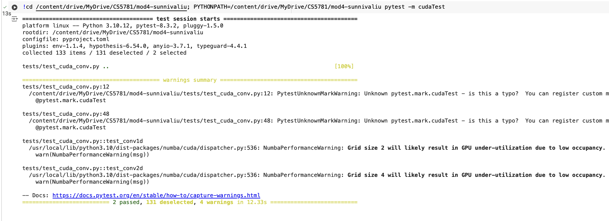

# MiniTorch Module 4


* Docs: https://minitorch.github.io/

* Overview: https://minitorch.github.io/module4.html

This module requires `fast_ops.py`, `cuda_ops.py`, `scalar.py`, `tensor_functions.py`, `tensor_data.py`, `tensor_ops.py`, `operators.py`, `module.py`, and `autodiff.py` from Module 3.


Additionally you will need to install and download the MNist library.

(On Mac, this may require installing the `wget` command)

```
pip install python-mnist
mnist_get_data.sh
```


* Tests:

```
python run_tests.py
```

This assignment requires the following files from the previous assignments. You can get these by running

```bash
python sync_previous_module.py previous-module-dir current-module-dir
```

The files that will be synced are:

        minitorch/tensor_data.py minitorch/tensor_functions.py minitorch/tensor_ops.py minitorch/operators.py minitorch/scalar.py minitorch/scalar_functions.py minitorch/module.py minitorch/autodiff.py minitorch/module.py project/run_manual.py project/run_scalar.py project/run_tensor.py minitorch/operators.py minitorch/module.py minitorch/autodiff.py minitorch/tensor.py minitorch/datasets.py minitorch/testing.py minitorch/optim.py minitorch/tensor_ops.py minitorch/fast_ops.py minitorch/cuda_ops.py project/parallel_check.py tests/test_tensor_general.py


* Task 4.4_b:

I have created test_cuda_conv.py and cuda_conv.py, respectively. I put it outside minitorch/ and tests/ folder due to style check ("- hook id: ruff-format - files were modified by this hook, 2 files reformatted, 24 files left unchanged")

Here's the output in Colab in comparing the result from CPU (torch implementation), and GPU (CUDA)




* MNIST (run_mnist_multiclass.py)

Epoch 1 loss 2.289011900662222 valid acc 2/16
Epoch 1 loss 11.490683165239707 valid acc 2/16
Epoch 1 loss 11.449550980226418 valid acc 2/16
Epoch 1 loss 11.43526015146782 valid acc 6/16
Epoch 1 loss 11.415885016813892 valid acc 4/16
Epoch 1 loss 11.208523505020338 valid acc 5/16
Epoch 1 loss 11.083294520343 valid acc 5/16
Epoch 1 loss 11.12376096135387 valid acc 5/16
Epoch 1 loss 10.748693951094808 valid acc 6/16
Epoch 1 loss 9.626097242634303 valid acc 5/16
Epoch 1 loss 9.183323970113733 valid acc 8/16
Epoch 1 loss 7.791989744809122 valid acc 9/16
Epoch 1 loss 7.937715966045311 valid acc 7/16
Epoch 1 loss 6.572880277904519 valid acc 9/16
Epoch 1 loss 6.6125602815341855 valid acc 7/16
Epoch 1 loss 6.225345987249478 valid acc 11/16
Epoch 1 loss 8.880185552834451 valid acc 8/16
Epoch 1 loss 6.5947865901777805 valid acc 11/16
Epoch 1 loss 5.929050395770865 valid acc 12/16
Epoch 1 loss 5.345122856009279 valid acc 13/16
Epoch 1 loss 4.848266068314377 valid acc 12/16
Epoch 1 loss 4.247865279884167 valid acc 10/16
Epoch 1 loss 3.5286345112547153 valid acc 12/16
Epoch 1 loss 4.601398748375214 valid acc 14/16
Epoch 1 loss 3.7270364581557605 valid acc 11/16
Epoch 1 loss 4.156622708444479 valid acc 10/16
Epoch 1 loss 5.048935669714997 valid acc 13/16
Epoch 1 loss 3.5535743068711634 valid acc 13/16
Epoch 1 loss 3.144125299445975 valid acc 13/16
Epoch 1 loss 3.3390108911876 valid acc 13/16
Epoch 1 loss 3.725987043713495 valid acc 12/16
Epoch 1 loss 3.576746711100033 valid acc 12/16
Epoch 1 loss 3.164399393618589 valid acc 12/16
Epoch 1 loss 4.191191609465498 valid acc 15/16
Epoch 1 loss 4.636267647569049 valid acc 14/16
Epoch 1 loss 4.0064661955372785 valid acc 12/16
Epoch 1 loss 3.016666834817386 valid acc 10/16
Epoch 1 loss 3.4535519795325635 valid acc 13/16
Epoch 1 loss 3.8967735944919695 valid acc 14/16
Epoch 1 loss 3.4352370653370925 valid acc 14/16
Epoch 1 loss 2.1643079726771344 valid acc 14/16
Epoch 1 loss 3.9380169399893923 valid acc 15/16
Epoch 1 loss 3.3821226790493903 valid acc 13/16
Epoch 1 loss 3.6817423060056624 valid acc 14/16
Epoch 1 loss 3.857497933101178 valid acc 15/16
Epoch 1 loss 2.5997114201624028 valid acc 15/16
Epoch 1 loss 3.4045739891011486 valid acc 14/16
Epoch 1 loss 3.355475159987699 valid acc 15/16
Epoch 1 loss 3.5800368376645078 valid acc 14/16
Epoch 1 loss 2.515597753992513 valid acc 14/16
Epoch 1 loss 3.126436653304846 valid acc 14/16
Epoch 1 loss 3.1165377937832366 valid acc 15/16
Epoch 1 loss 2.9933742358757716 valid acc 15/16
Epoch 1 loss 2.269990793717281 valid acc 15/16
Epoch 1 loss 3.393864067555725 valid acc 14/16
Epoch 1 loss 2.163522447388379 valid acc 15/16
Epoch 1 loss 2.5238007192693415 valid acc 14/16
Epoch 1 loss 2.3376440832970156 valid acc 14/16
Epoch 1 loss 2.5745735592181282 valid acc 13/16
Epoch 1 loss 3.6791932518427912 valid acc 14/16
Epoch 1 loss 3.5883438686199245 valid acc 13/16
Epoch 1 loss 3.047737460746912 valid acc 13/16
Epoch 1 loss 3.6904322402032346 valid acc 13/16
Epoch 2 loss 0.7992335403911162 valid acc 14/16
Epoch 2 loss 3.0418986829752948 valid acc 15/16
Epoch 2 loss 3.2268401535352718 valid acc 15/16
Epoch 2 loss 3.1403595939107856 valid acc 15/16
Epoch 2 loss 2.8532697170883 valid acc 15/16
Epoch 2 loss 2.3746566148728907 valid acc 14/16
Epoch 2 loss 2.3725881056866314 valid acc 14/16
Epoch 2 loss 2.8029217241772844 valid acc 14/16
Epoch 2 loss 3.0121441775936666 valid acc 13/16
Epoch 2 loss 2.03055501429843 valid acc 14/16
Epoch 2 loss 2.6296789600364683 valid acc 14/16
Epoch 2 loss 3.5400850114056053 valid acc 14/16
Epoch 2 loss 3.649213346375341 valid acc 13/16
Epoch 2 loss 3.441789421297136 valid acc 13/16
Epoch 2 loss 4.000200090546109 valid acc 15/16
Epoch 2 loss 3.031148080643057 valid acc 15/16
Epoch 2 loss 3.3535131798247146 valid acc 12/16
Epoch 2 loss 3.3180152154221374 valid acc 13/16
Epoch 2 loss 3.0257157261933436 valid acc 14/16
Epoch 2 loss 2.631976529840433 valid acc 14/16
Epoch 2 loss 1.8259530941945692 valid acc 12/16
Epoch 2 loss 2.3960762728987715 valid acc 11/16
Epoch 2 loss 2.2982555448457296 valid acc 14/16
Epoch 2 loss 3.2339692363334023 valid acc 15/16
Epoch 2 loss 2.542670630208287 valid acc 14/16
Epoch 2 loss 2.1020659298912374 valid acc 12/16
Epoch 2 loss 3.6391030813971836 valid acc 15/16
Epoch 2 loss 2.1287174862732767 valid acc 13/16
Epoch 2 loss 2.0862559151136835 valid acc 14/16
Epoch 2 loss 1.5172459253177553 valid acc 12/16
Epoch 2 loss 2.0286443125232716 valid acc 14/16
Epoch 2 loss 2.269348214237228 valid acc 13/16
Epoch 2 loss 1.543195116388739 valid acc 12/16
Epoch 2 loss 2.224658545606534 valid acc 13/16
Epoch 2 loss 3.0341825570674996 valid acc 14/16
Epoch 2 loss 2.7124496041888797 valid acc 14/16
Epoch 2 loss 2.423760102102659 valid acc 12/16
Epoch 2 loss 1.9701858555175151 valid acc 14/16
Epoch 2 loss 3.5511933852076676 valid acc 16/16
Epoch 2 loss 2.641592440620318 valid acc 14/16
Epoch 2 loss 1.7114840763789272 valid acc 15/16
Epoch 2 loss 1.8003511176037816 valid acc 14/16
Epoch 2 loss 2.739292864380646 valid acc 12/16
Epoch 2 loss 1.759728260006479 valid acc 13/16
Epoch 2 loss 2.9794674253976705 valid acc 12/16
Epoch 2 loss 2.420963086488393 valid acc 14/16
Epoch 2 loss 2.6341738370078946 valid acc 14/16
Epoch 2 loss 2.686409876493966 valid acc 15/16
Epoch 2 loss 2.0252487342151912 valid acc 14/16
Epoch 2 loss 1.288861254988364 valid acc 15/16
Epoch 2 loss 1.4558718631141974 valid acc 15/16
Epoch 2 loss 2.022417553155589 valid acc 15/16
Epoch 2 loss 2.5478922428766535 valid acc 14/16
Epoch 2 loss 2.27613715933253 valid acc 15/16
Epoch 2 loss 2.3911149323914422 valid acc 14/16
Epoch 2 loss 1.6309805923943657 valid acc 15/16
Epoch 2 loss 1.9512094127574549 valid acc 14/16
Epoch 2 loss 2.2438476906697695 valid acc 15/16
Epoch 2 loss 2.4139584938956897 valid acc 13/16
Epoch 2 loss 2.1779822272091076 valid acc 12/16
Epoch 2 loss 2.7370177958900803 valid acc 14/16
Epoch 2 loss 2.171522856120064 valid acc 13/16
Epoch 2 loss 2.8924583439734874 valid acc 15/16
Epoch 3 loss 0.07404436103750167 valid acc 15/16
Epoch 3 loss 2.199897069222596 valid acc 15/16
Epoch 3 loss 1.8594749521689447 valid acc 15/16
Epoch 3 loss 2.0587684805677315 valid acc 13/16
Epoch 3 loss 2.2510349119454727 valid acc 15/16
Epoch 3 loss 1.2074031841150552 valid acc 16/16
Epoch 3 loss 1.7709652086280923 valid acc 14/16
Epoch 3 loss 2.1332593485050912 valid acc 14/16
Epoch 3 loss 2.1642032962877176 valid acc 13/16
Epoch 3 loss 2.016784294912804 valid acc 16/16
Epoch 3 loss 1.9258291179922273 valid acc 15/16
Epoch 3 loss 3.1261297802599906 valid acc 12/16
Epoch 3 loss 2.4410168599095803 valid acc 14/16
Epoch 3 loss 3.003899307961177 valid acc 14/16
Epoch 3 loss 4.042996205045022 valid acc 13/16
Epoch 3 loss 2.3250805376332786 valid acc 14/16
Epoch 3 loss 3.914496825054233 valid acc 13/16
Epoch 3 loss 2.4398425021403396 valid acc 14/16
Epoch 3 loss 1.6864974952296623 valid acc 15/16
Epoch 3 loss 1.219129035197053 valid acc 15/16
Epoch 3 loss 2.5631609895667085 valid acc 12/16
Epoch 3 loss 2.064760492985058 valid acc 13/16
Epoch 3 loss 1.3391521564311437 valid acc 15/16
Epoch 3 loss 2.2329622703328136 valid acc 13/16
Epoch 3 loss 1.7539721710730438 valid acc 13/16
Epoch 3 loss 1.164933851714077 valid acc 13/16
Epoch 3 loss 1.9078693433731213 valid acc 14/16
Epoch 3 loss 2.009035086708083 valid acc 14/16
Epoch 3 loss 1.2007314552996982 valid acc 13/16
Epoch 3 loss 1.0595441459304271 valid acc 14/16
Epoch 3 loss 1.6573061507908702 valid acc 14/16
Epoch 3 loss 2.0383127635241154 valid acc 14/16
Epoch 3 loss 1.1210764998583067 valid acc 13/16
Epoch 3 loss 1.823187867483778 valid acc 13/16
Epoch 3 loss 2.8531742588564324 valid acc 16/16
Epoch 3 loss 1.9512745284303956 valid acc 14/16
Epoch 3 loss 1.7409459241562713 valid acc 13/16
Epoch 3 loss 1.4186363786004321 valid acc 11/16
Epoch 3 loss 2.0185278507334883 valid acc 14/16
Epoch 3 loss 2.0703857200997335 valid acc 14/16
Epoch 3 loss 1.2442959255682973 valid acc 16/16
Epoch 3 loss 1.423323865039045 valid acc 16/16
Epoch 3 loss 1.5018837610860913 valid acc 14/16
Epoch 3 loss 1.0039466123673646 valid acc 16/16
Epoch 3 loss 3.0839064928781674 valid acc 13/16
Epoch 3 loss 1.308086462257156 valid acc 16/16
Epoch 3 loss 2.0244280609188063 valid acc 15/16
Epoch 3 loss 2.5061682386181285 valid acc 14/16
Epoch 3 loss 1.6619667266744351 valid acc 13/16
Epoch 3 loss 1.4291261857824984 valid acc 15/16
Epoch 3 loss 1.3675374771357867 valid acc 15/16
Epoch 3 loss 1.2268745274723467 valid acc 15/16
Epoch 3 loss 1.7236158644049286 valid acc 14/16
Epoch 3 loss 1.437520126796628 valid acc 15/16
Epoch 3 loss 2.2833498731960833 valid acc 14/16
Epoch 3 loss 1.490865686028056 valid acc 15/16
Epoch 3 loss 1.1264584393551198 valid acc 15/16
Epoch 3 loss 1.889051360961614 valid acc 15/16
Epoch 3 loss 1.9960426144323113 valid acc 14/16
Epoch 3 loss 0.9574140811121408 valid acc 13/16
Epoch 3 loss 1.9093095703927754 valid acc 14/16
Epoch 3 loss 1.5448085744233975 valid acc 13/16
Epoch 3 loss 2.0547335860374574 valid acc 14/16
Epoch 4 loss 0.04813162820378036 valid acc 15/16
Epoch 4 loss 0.9924806382204253 valid acc 14/16
Epoch 4 loss 1.838966886517666 valid acc 14/16
Epoch 4 loss 1.9856173245810862 valid acc 14/16
Epoch 4 loss 1.9490309404379207 valid acc 14/16
Epoch 4 loss 1.8337443013012806 valid acc 14/16
Epoch 4 loss 1.9728933269051097 valid acc 14/16
Epoch 4 loss 1.641281584318154 valid acc 13/16
Epoch 4 loss 1.9879908422510664 valid acc 14/16
Epoch 4 loss 1.1623382725458715 valid acc 14/16
Epoch 4 loss 0.8077960404932073 valid acc 14/16
Epoch 4 loss 2.3867841447940545 valid acc 15/16
Epoch 4 loss 2.1282818625937048 valid acc 16/16
Epoch 4 loss 2.5295903247943796 valid acc 14/16
Epoch 4 loss 2.5765632833152696 valid acc 13/16
Epoch 4 loss 1.265040870669153 valid acc 14/16
Epoch 4 loss 3.0358342790378225 valid acc 15/16
Epoch 4 loss 2.1570445994832594 valid acc 15/16
Epoch 4 loss 1.1828257744160353 valid acc 15/16
Epoch 4 loss 1.1100025446583313 valid acc 15/16
Epoch 4 loss 1.405116616788282 valid acc 13/16
Epoch 4 loss 0.9852764888032928 valid acc 12/16
Epoch 4 loss 0.5867491228701155 valid acc 14/16
Epoch 4 loss 1.7731722201789224 valid acc 14/16
Epoch 4 loss 1.0380251657722064 valid acc 15/16
Epoch 4 loss 1.5496187608819492 valid acc 14/16
Epoch 4 loss 0.8715241482273198 valid acc 14/16
Epoch 4 loss 1.3096953996418947 valid acc 15/16
Epoch 4 loss 1.485026870739031 valid acc 14/16
Epoch 4 loss 0.8597993258859131 valid acc 15/16
Epoch 4 loss 1.7600035320890857 valid acc 15/16
Epoch 4 loss 1.4907933864357064 valid acc 14/16
Epoch 4 loss 0.8337562741369625 valid acc 15/16
Epoch 4 loss 1.1347828970154934 valid acc 15/16
Epoch 4 loss 2.5101484104527865 valid acc 15/16
Epoch 4 loss 1.324488969955285 valid acc 14/16
Epoch 4 loss 1.6691739168197304 valid acc 14/16
Epoch 4 loss 1.1619119431838585 valid acc 15/16
Epoch 4 loss 1.655109453241929 valid acc 16/16
Epoch 4 loss 1.9950182878470892 valid acc 15/16
Epoch 4 loss 0.8135078970114136 valid acc 15/16
Epoch 4 loss 1.0916949578194082 valid acc 16/16
Epoch 4 loss 1.272742177006431 valid acc 16/16
Epoch 4 loss 0.6051232102991739 valid acc 14/16
Epoch 4 loss 1.7639628110369185 valid acc 13/16
Epoch 4 loss 1.0744951129598197 valid acc 16/16
Epoch 4 loss 1.519294493657816 valid acc 15/16
Epoch 4 loss 2.0826389231047058 valid acc 15/16
Epoch 4 loss 0.8318382180140063 valid acc 14/16
Epoch 4 loss 0.8180732271351309 valid acc 15/16
Epoch 4 loss 0.8436430165249607 valid acc 14/16
Epoch 4 loss 0.8656025303228652 valid acc 14/16
Epoch 4 loss 1.5028820094879558 valid acc 14/16
Epoch 4 loss 1.0052249062091791 valid acc 14/16
Epoch 4 loss 1.9421274834310225 valid acc 13/16
Epoch 4 loss 1.0315819334950114 valid acc 15/16
Epoch 4 loss 1.2891056627647797 valid acc 16/16
Epoch 4 loss 1.7944366890193293 valid acc 14/16
Epoch 4 loss 1.9365497767148145 valid acc 14/16
Epoch 4 loss 0.9139292210896369 valid acc 15/16
Epoch 4 loss 1.5514310655733439 valid acc 14/16
Epoch 4 loss 1.4234183554559758 valid acc 15/16
Epoch 4 loss 1.782258315322564 valid acc 14/16
Epoch 5 loss 0.07105202986822784 valid acc 14/16
Epoch 5 loss 1.2664642216476385 valid acc 15/16
Epoch 5 loss 1.5637992213534229 valid acc 14/16
Epoch 5 loss 1.005085641743893 valid acc 14/16
Epoch 5 loss 0.8992193174776129 valid acc 14/16
Epoch 5 loss 0.8375706079316817 valid acc 14/16
Epoch 5 loss 1.9930708667851937 valid acc 14/16
Epoch 5 loss 1.1008410008068035 valid acc 14/16
Epoch 5 loss 1.2885445971651843 valid acc 13/16
Epoch 5 loss 1.2426003283594484 valid acc 13/16
Epoch 5 loss 1.4752044902088348 valid acc 13/16
Epoch 5 loss 2.4075161858341527 valid acc 14/16
Epoch 5 loss 1.8640940932539611 valid acc 14/16
Epoch 5 loss 1.5221512871918834 valid acc 12/16
Epoch 5 loss 1.718277831397883 valid acc 14/16
Epoch 5 loss 0.8759352906688427 valid acc 14/16
Epoch 5 loss 2.718416669754159 valid acc 12/16
Epoch 5 loss 2.378753050150813 valid acc 14/16
Epoch 5 loss 1.4467088946798965 valid acc 12/16
Epoch 5 loss 1.6024146276217044 valid acc 13/16
Epoch 5 loss 1.2225438420071293 valid acc 12/16
Epoch 5 loss 1.2903887454730483 valid acc 14/16
Epoch 5 loss 0.5406969345619757 valid acc 15/16
Epoch 5 loss 1.6694366291552845 valid acc 14/16
Epoch 5 loss 0.9699378717390698 valid acc 16/16
Epoch 5 loss 1.2723620362801542 valid acc 14/16
Epoch 5 loss 1.1024771313008648 valid acc 15/16
Epoch 5 loss 1.2358636415463389 valid acc 13/16
Epoch 5 loss 1.1956492939530066 valid acc 13/16
Epoch 5 loss 0.5740356142715816 valid acc 13/16
Epoch 5 loss 1.1930062791427933 valid acc 14/16
Epoch 5 loss 1.910340016003283 valid acc 15/16
Epoch 5 loss 0.754711783339085 valid acc 13/16
Epoch 5 loss 0.8307808148628304 valid acc 15/16
Epoch 5 loss 1.6701885455746752 valid acc 14/16
Epoch 5 loss 0.9921002104851198 valid acc 15/16
Epoch 5 loss 0.8271303533283396 valid acc 14/16
Epoch 5 loss 0.7438559859271182 valid acc 16/16
Epoch 5 loss 1.3466607729469344 valid acc 16/16
Epoch 5 loss 1.06381665509981 valid acc 15/16
Epoch 5 loss 0.6592439113527719 valid acc 16/16
Epoch 5 loss 1.1678316540239235 valid acc 16/16
Epoch 5 loss 0.8325435436946707 valid acc 14/16
Epoch 5 loss 0.4596147652610334 valid acc 16/16
Epoch 5 loss 1.504803770838998 valid acc 14/16
Epoch 5 loss 0.9312515738068574 valid acc 15/16
Epoch 5 loss 1.667280526620705 valid acc 16/16
Epoch 5 loss 2.3691308712710377 valid acc 15/16
Epoch 5 loss 0.8278686459607303 valid acc 15/16
Epoch 5 loss 0.8158561695564864 valid acc 15/16
Epoch 5 loss 0.8589358584163274 valid acc 16/16
Epoch 5 loss 0.8722325605377995 valid acc 16/16
Epoch 5 loss 1.4465898011999572 valid acc 15/16
Epoch 5 loss 1.1083315103470495 valid acc 15/16
Epoch 5 loss 2.0205416791239865 valid acc 16/16
Epoch 5 loss 1.0795358910038348 valid acc 15/16
Epoch 5 loss 1.226977483352599 valid acc 16/16
Epoch 5 loss 1.0560360244268205 valid acc 14/16
Epoch 5 loss 1.3054751219232468 valid acc 13/16
Epoch 5 loss 1.117818602381595 valid acc 13/16
Epoch 5 loss 1.0331543335365254 valid acc 13/16
Epoch 5 loss 1.4410833388699646 valid acc 15/16
Epoch 5 loss 1.3222855204886854 valid acc 15/16
Epoch 6 loss 0.02427455044158705 valid acc 15/16
Epoch 6 loss 1.1777305663496813 valid acc 14/16
Epoch 6 loss 1.6992002802992767 valid acc 16/16
Epoch 6 loss 1.020466235886992 valid acc 14/16
Epoch 6 loss 0.6353039687032789 valid acc 15/16
Epoch 6 loss 0.4935603449532448 valid acc 15/16
Epoch 6 loss 1.1948910772079606 valid acc 14/16
Epoch 6 loss 1.35054729496072 valid acc 14/16
Epoch 6 loss 0.8264429507574167 valid acc 15/16
Epoch 6 loss 0.8272875401703255 valid acc 15/16
Epoch 6 loss 1.1087179116945425 valid acc 14/16
Epoch 6 loss 1.7780844518178416 valid acc 14/16
Epoch 6 loss 1.5032059474199424 valid acc 14/16
Epoch 6 loss 1.4133997895957404 valid acc 14/16
Epoch 6 loss 2.0266003850184795 valid acc 15/16
Epoch 6 loss 0.7854588067693966 valid acc 14/16
Epoch 6 loss 2.0690512427178493 valid acc 14/16
Epoch 6 loss 1.7363841674246923 valid acc 14/16
Epoch 6 loss 0.8017845853891736 valid acc 13/16
Epoch 6 loss 0.5498338862855787 valid acc 14/16
Epoch 6 loss 1.9246168992820742 valid acc 13/16
Epoch 6 loss 1.2119517942727969 valid acc 13/16
Epoch 6 loss 0.4621465772684414 valid acc 13/16
Epoch 6 loss 1.052481180712918 valid acc 14/16
Epoch 6 loss 0.7419587278387612 valid acc 14/16
Epoch 6 loss 0.9814542611579216 valid acc 14/16
Epoch 6 loss 0.8250835920493858 valid acc 14/16
Epoch 6 loss 1.008895695956189 valid acc 14/16
Epoch 6 loss 0.9130818411889268 valid acc 13/16
Epoch 6 loss 0.4084129692970834 valid acc 13/16
Epoch 6 loss 1.179687720074094 valid acc 14/16
Epoch 6 loss 1.2012746355368455 valid acc 14/16
Epoch 6 loss 0.7881567736969745 valid acc 14/16
Epoch 6 loss 0.8526473417960703 valid acc 13/16
Epoch 6 loss 1.5994553678291727 valid acc 15/16
Epoch 6 loss 0.4839925183574514 valid acc 15/16
Epoch 6 loss 1.060547783548277 valid acc 15/16
Epoch 6 loss 0.453662108917894 valid acc 16/16
Epoch 6 loss 0.9639286048957554 valid acc 15/16
Epoch 6 loss 0.9484683392575408 valid acc 15/16
Epoch 6 loss 0.41714973116305776 valid acc 16/16
Epoch 6 loss 1.0079871835256446 valid acc 15/16
Epoch 6 loss 0.5372065016786394 valid acc 15/16
Epoch 6 loss 0.39220424045009367 valid acc 16/16
Epoch 6 loss 1.8505387715440953 valid acc 15/16
Epoch 6 loss 0.595163729263656 valid acc 16/16
Epoch 6 loss 1.2630523917822933 valid acc 16/16
Epoch 6 loss 1.1940812301949477 valid acc 15/16
Epoch 6 loss 0.580899124715523 valid acc 13/16
Epoch 6 loss 0.6097481785227226 valid acc 14/16
Epoch 6 loss 0.53571304023767 valid acc 15/16
Epoch 6 loss 0.6123199348169803 valid acc 14/16
Epoch 6 loss 1.047350638945771 valid acc 14/16
Epoch 6 loss 0.6594304050054624 valid acc 15/16
Epoch 6 loss 1.4123335935274872 valid acc 15/16
Epoch 6 loss 0.6591291519228613 valid acc 14/16
Epoch 6 loss 0.7225117674382127 valid acc 15/16
Epoch 6 loss 1.2934130895847782 valid acc 16/16
Epoch 6 loss 1.0850177796542768 valid acc 15/16
Epoch 6 loss 0.48485573923965275 valid acc 13/16
Epoch 6 loss 0.5842315003940205 valid acc 13/16
Epoch 6 loss 1.071476276341833 valid acc 15/16
Epoch 6 loss 1.8087996872586536 valid acc 15/16
Epoch 7 loss 0.10584739677979824 valid acc 14/16
Epoch 7 loss 1.2583621565616574 valid acc 14/16
Epoch 7 loss 1.226471887562793 valid acc 16/16
Epoch 7 loss 0.6843581429447492 valid acc 15/16
Epoch 7 loss 0.5910750070612043 valid acc 14/16
Epoch 7 loss 0.4090323865076789 valid acc 15/16
Epoch 7 loss 1.1979073903128943 valid acc 15/16
Epoch 7 loss 0.8221952972091333 valid acc 15/16
Epoch 7 loss 0.9645664509201137 valid acc 15/16
Epoch 7 loss 0.6516997880684468 valid acc 14/16
Epoch 7 loss 0.5227038342196071 valid acc 15/16
Epoch 7 loss 1.459279798002386 valid acc 13/16
Epoch 7 loss 1.1285814146170217 valid acc 15/16
Epoch 7 loss 1.4803593725939748 valid acc 14/16
Epoch 7 loss 1.1355937446625513 valid acc 15/16
Epoch 7 loss 0.6877583766789723 valid acc 14/16
Epoch 7 loss 1.674231424767545 valid acc 14/16
Epoch 7 loss 1.5834957651172932 valid acc 14/16
Epoch 7 loss 0.7131033051325288 valid acc 15/16
Epoch 7 loss 0.9285498731964082 valid acc 14/16
Epoch 7 loss 1.1084827004334479 valid acc 14/16
Epoch 7 loss 1.0334019351272103 valid acc 14/16
Epoch 7 loss 0.2542150341110855 valid acc 15/16
Epoch 7 loss 0.7642705874265985 valid acc 14/16
Epoch 7 loss 1.1922576320518181 valid acc 12/16
Epoch 7 loss 1.3014230668967106 valid acc 14/16
Epoch 7 loss 0.6758975293256231 valid acc 15/16
Epoch 7 loss 0.8182946008897964 valid acc 13/16
Epoch 7 loss 0.40299639669670184 valid acc 15/16
Epoch 7 loss 0.813069098505599 valid acc 12/16
Epoch 7 loss 0.9313798204462409 valid acc 14/16
Epoch 7 loss 0.8234804594243357 valid acc 13/16
Epoch 7 loss 0.5477346669222831 valid acc 14/16
Epoch 7 loss 0.5363962955200859 valid acc 14/16
Epoch 7 loss 1.7266013530685909 valid acc 16/16
Epoch 7 loss 0.8425877703374733 valid acc 16/16
Epoch 7 loss 0.7235297202027642 valid acc 13/16
Epoch 7 loss 0.721161334061709 valid acc 15/16
Epoch 7 loss 0.9183156813338924 valid acc 15/16
Epoch 7 loss 0.7977186182660347 valid acc 15/16
Epoch 7 loss 0.605772303725236 valid acc 16/16
Epoch 7 loss 0.7476608475510018 valid acc 16/16
Epoch 7 loss 0.9789378742375805 valid acc 16/16
Epoch 7 loss 0.43882663345625356 valid acc 15/16
Epoch 7 loss 1.1501865367138622 valid acc 16/16
Epoch 7 loss 0.43046540692449065 valid acc 16/16
Epoch 7 loss 0.6262738460934891 valid acc 15/16
Epoch 7 loss 1.214509548273409 valid acc 16/16
Epoch 7 loss 0.47838627808774553 valid acc 15/16
Epoch 7 loss 0.7410489409519743 valid acc 15/16
Epoch 7 loss 0.5751903942011212 valid acc 15/16
Epoch 7 loss 0.5541726401626688 valid acc 16/16
Epoch 7 loss 1.165535615707683 valid acc 14/16
Epoch 7 loss 0.24650501749006712 valid acc 15/16
Epoch 7 loss 1.0535982014117942 valid acc 14/16
Epoch 7 loss 0.7691877559969019 valid acc 15/16
Epoch 7 loss 0.7937777297449086 valid acc 14/16
Epoch 7 loss 0.9414879365383403 valid acc 15/16
Epoch 7 loss 1.4379553847586186 valid acc 13/16
Epoch 7 loss 1.0549991945719939 valid acc 14/16
Epoch 7 loss 0.6061042392367552 valid acc 13/16
Epoch 7 loss 0.5131545510334097 valid acc 16/16
Epoch 7 loss 1.1476985582790933 valid acc 14/16
Epoch 8 loss 0.004671522600072531 valid acc 14/16
Epoch 8 loss 0.843084509074574 valid acc 14/16
Epoch 8 loss 1.6459336178114368 valid acc 14/16
Epoch 8 loss 0.9452211537656465 valid acc 16/16
Epoch 8 loss 0.6485761899947409 valid acc 15/16
Epoch 8 loss 0.4497085808596062 valid acc 16/16
Epoch 8 loss 1.2299408397842424 valid acc 13/16
Epoch 8 loss 0.585640538568332 valid acc 14/16
Epoch 8 loss 0.6816371791631951 valid acc 15/16
Epoch 8 loss 0.6504538980538958 valid acc 15/16
Epoch 8 loss 0.7993900415170366 valid acc 14/16
Epoch 8 loss 1.535409584165765 valid acc 13/16
Epoch 8 loss 1.0462850531033443 valid acc 15/16
Epoch 8 loss 1.5300571265639649 valid acc 14/16
Epoch 8 loss 1.1033055798284264 valid acc 14/16
Epoch 8 loss 0.6884043523087611 valid acc 15/16
Epoch 8 loss 1.4447556074910994 valid acc 15/16
Epoch 8 loss 1.186511280756609 valid acc 13/16
Epoch 8 loss 1.0665851979043748 valid acc 14/16
Epoch 8 loss 0.6351036224693903 valid acc 15/16
Epoch 8 loss 0.9717120616004687 valid acc 14/16
Epoch 8 loss 0.4275851723906357 valid acc 15/16
Epoch 8 loss 0.31127534866608564 valid acc 16/16
Epoch 8 loss 0.560191987410111 valid acc 15/16
Epoch 8 loss 0.6741525603364913 valid acc 13/16
Epoch 8 loss 0.9697458167891633 valid acc 14/16
Epoch 8 loss 0.17775425217315483 valid acc 15/16
Epoch 8 loss 0.48878440525674216 valid acc 15/16
Epoch 8 loss 0.4801016821588976 valid acc 15/16
Epoch 8 loss 0.537643794932626 valid acc 16/16
Epoch 8 loss 1.080101780746923 valid acc 14/16
Epoch 8 loss 1.225589150202304 valid acc 15/16
Epoch 8 loss 0.41445233924903446 valid acc 15/16
Epoch 8 loss 0.7565843494256568 valid acc 16/16
Epoch 8 loss 1.6053571725816382 valid acc 16/16
Epoch 8 loss 0.7684514757329306 valid acc 16/16
Epoch 8 loss 0.7062080312280206 valid acc 15/16
Epoch 8 loss 0.6695221289173932 valid acc 15/16
Epoch 8 loss 1.2252794357584513 valid acc 16/16
Epoch 8 loss 0.651262035478347 valid acc 16/16
Epoch 8 loss 0.2841959123842501 valid acc 15/16
Epoch 8 loss 0.7467955694645351 valid acc 15/16
Epoch 8 loss 0.7053093647294095 valid acc 15/16
Epoch 8 loss 0.6075365568488647 valid acc 16/16
Epoch 8 loss 1.543975062247051 valid acc 15/16
Epoch 8 loss 0.43922450268027075 valid acc 15/16
Epoch 8 loss 1.1176285121141465 valid acc 14/16
Epoch 8 loss 1.2022685970098963 valid acc 13/16
Epoch 8 loss 0.41595719334249276 valid acc 14/16
Epoch 8 loss 0.46675423526704163 valid acc 14/16
Epoch 8 loss 0.3883227148182206 valid acc 16/16
Epoch 8 loss 0.501038187623755 valid acc 16/16
Epoch 8 loss 0.8352579381314472 valid acc 13/16
Epoch 8 loss 0.23913702517736385 valid acc 14/16
Epoch 8 loss 0.6504019982710771 valid acc 14/16
Epoch 8 loss 0.3932062607767514 valid acc 16/16
Epoch 8 loss 0.7939261360552332 valid acc 15/16
Epoch 8 loss 1.0049854569669445 valid acc 12/16
Epoch 8 loss 1.1103033407577134 valid acc 14/16
Epoch 8 loss 0.7798301261165417 valid acc 14/16
Epoch 8 loss 0.9683785450944773 valid acc 15/16
Epoch 8 loss 1.1618916015434253 valid acc 15/16
Epoch 8 loss 0.712561694746517 valid acc 14/16
Epoch 9 loss 0.008670049266410573 valid acc 15/16
Epoch 9 loss 0.6548203525385894 valid acc 15/16
Epoch 9 loss 1.2718953828869577 valid acc 16/16
Epoch 9 loss 0.7877779869872914 valid acc 14/16
Epoch 9 loss 0.4733831869600615 valid acc 15/16
Epoch 9 loss 0.39946617525917194 valid acc 14/16
Epoch 9 loss 0.9670111213811842 valid acc 14/16
Epoch 9 loss 0.5994676114138304 valid acc 16/16
Epoch 9 loss 0.86331267136617 valid acc 15/16
Epoch 9 loss 0.513274299319628 valid acc 14/16
Epoch 9 loss 0.4935803003080709 valid acc 15/16
Epoch 9 loss 1.1122835151507307 valid acc 14/16
Epoch 9 loss 1.091587215144771 valid acc 14/16
Epoch 9 loss 1.4245066109806166 valid acc 15/16
Epoch 9 loss 0.9448768402771064 valid acc 14/16
Epoch 9 loss 0.6293713935059166 valid acc 14/16
Epoch 9 loss 1.4967482544553723 valid acc 15/16
Epoch 9 loss 0.8803842176392733 valid acc 16/16
Epoch 9 loss 0.5961665876033169 valid acc 16/16
Epoch 9 loss 0.6252414118247243 valid acc 15/16
Epoch 9 loss 0.8970781217478812 valid acc 13/16
Epoch 9 loss 0.5217438785470745 valid acc 15/16
Epoch 9 loss 0.19592553960714354 valid acc 13/16
Epoch 9 loss 1.1522694402953555 valid acc 13/16
Epoch 9 loss 0.4633405475566182 valid acc 14/16
Epoch 9 loss 1.111986185430764 valid acc 13/16
Epoch 9 loss 0.4979401929480236 valid acc 16/16
Epoch 9 loss 0.3378084594016353 valid acc 15/16
Epoch 9 loss 1.0311513441722728 valid acc 15/16
Epoch 9 loss 0.4206591260361283 valid acc 15/16
Epoch 9 loss 0.8098529933866094 valid acc 14/16
Epoch 9 loss 1.109377907119777 valid acc 13/16
Epoch 9 loss 0.6967105079646976 valid acc 14/16
Epoch 9 loss 0.5857323449551228 valid acc 15/16
Epoch 9 loss 1.6056955760262106 valid acc 15/16
Epoch 9 loss 0.7973178970453321 valid acc 14/16
Epoch 9 loss 0.5710223007543906 valid acc 15/16
Epoch 9 loss 0.2644015589091271 valid acc 16/16
Epoch 9 loss 0.4557684845484888 valid acc 16/16
Epoch 9 loss 0.8246091194574092 valid acc 15/16
Epoch 9 loss 0.2514996541656228 valid acc 16/16
Epoch 9 loss 0.6666052279978684 valid acc 15/16
Epoch 9 loss 0.5294036012527966 valid acc 16/16
Epoch 9 loss 0.45824294076149025 valid acc 15/16
Epoch 9 loss 1.3408292419286325 valid acc 16/16
Epoch 9 loss 0.33850225826444963 valid acc 16/16
Epoch 9 loss 0.4919731261566324 valid acc 15/16
Epoch 9 loss 0.8054340346894899 valid acc 16/16
Epoch 9 loss 0.47161047672590944 valid acc 15/16
Epoch 9 loss 0.3850157114678833 valid acc 15/16
Epoch 9 loss 0.3358854983980347 valid acc 16/16
Epoch 9 loss 0.3433637048762836 valid acc 14/16
Epoch 9 loss 0.6979687236834233 valid acc 15/16
Epoch 9 loss 0.4986106472670629 valid acc 16/16
Epoch 9 loss 0.8391624358901391 valid acc 15/16
Epoch 9 loss 0.48906429169622767 valid acc 16/16
Epoch 9 loss 0.4591308879735956 valid acc 15/16
Epoch 9 loss 0.9807976494344117 valid acc 15/16
Epoch 9 loss 0.9436325613289123 valid acc 15/16
Epoch 9 loss 0.5559785761784919 valid acc 15/16
Epoch 9 loss 0.7252902561235677 valid acc 15/16
Epoch 9 loss 0.7808564037301201 valid acc 15/16
Epoch 9 loss 1.1737938078493415 valid acc 16/16
Epoch 10 loss 0.0020321652142996083 valid acc 14/16
Epoch 10 loss 0.7927243952270198 valid acc 15/16
Epoch 10 loss 1.3827844361942507 valid acc 15/16
Epoch 10 loss 1.4079545619312825 valid acc 15/16
Epoch 10 loss 0.6906778752333533 valid acc 15/16
Epoch 10 loss 0.5369493708887941 valid acc 15/16
Epoch 10 loss 1.3003437033594487 valid acc 15/16
Epoch 10 loss 0.5910132250559571 valid acc 15/16
Epoch 10 loss 0.6072450174762718 valid acc 16/16
Epoch 10 loss 0.34819562235291257 valid acc 15/16
Epoch 10 loss 0.43071776797621036 valid acc 15/16
Epoch 10 loss 0.7865407454215798 valid acc 16/16
Epoch 10 loss 1.1500476932650479 valid acc 16/16
Epoch 10 loss 0.9703682612782967 valid acc 16/16
Epoch 10 loss 0.8120393061302342 valid acc 14/16
Epoch 10 loss 0.46614600005068 valid acc 14/16
Epoch 10 loss 1.2206774348918121 valid acc 13/16
Epoch 10 loss 1.4824843272036077 valid acc 15/16
Epoch 10 loss 0.9411928884378375 valid acc 14/16
Epoch 10 loss 0.34123102783893305 valid acc 14/16
Epoch 10 loss 0.9567335385420521 valid acc 14/16
Epoch 10 loss 0.4739702972057838 valid acc 14/16
Epoch 10 loss 0.14221579450867827 valid acc 13/16
Epoch 10 loss 0.24838934088527279 valid acc 14/16
Epoch 10 loss 0.24540839040352647 valid acc 14/16
Epoch 10 loss 0.7249479854024743 valid acc 14/16
Epoch 10 loss 0.664669427320121 valid acc 15/16
Epoch 10 loss 0.31129663290888093 valid acc 16/16
Epoch 10 loss 1.0578881836124554 valid acc 14/16
Epoch 10 loss 0.27861456766178605 valid acc 14/16
Epoch 10 loss 0.5094653924106047 valid acc 16/16
Epoch 10 loss 0.4967572735126039 valid acc 14/16
Epoch 10 loss 0.5445936627040558 valid acc 14/16
Epoch 10 loss 0.8054482893907482 valid acc 14/16
Epoch 10 loss 1.4793693380386266 valid acc 15/16
Epoch 10 loss 0.5363313726637418 valid acc 15/16
Epoch 10 loss 0.5546920981294053 valid acc 16/16
Epoch 10 loss 0.527301357343074 valid acc 15/16
Epoch 10 loss 0.4365671598744523 valid acc 16/16
Epoch 10 loss 0.7658605326537136 valid acc 15/16
Epoch 10 loss 0.3695338055661013 valid acc 15/16
Epoch 10 loss 0.4994068410519513 valid acc 16/16
Epoch 10 loss 0.46685201840795265 valid acc 15/16
Epoch 10 loss 0.6394993281888388 valid acc 16/16
Epoch 10 loss 0.9073946894476769 valid acc 16/16
Epoch 10 loss 0.7380787083819949 valid acc 15/16
Epoch 10 loss 0.4543707987296429 valid acc 16/16
Epoch 10 loss 1.3640817896014723 valid acc 16/16
Epoch 10 loss 0.4842853333903831 valid acc 16/16
Epoch 10 loss 0.5595190244524215 valid acc 15/16
Epoch 10 loss 0.22867920814268575 valid acc 15/16
Epoch 10 loss 0.43688398652543015 valid acc 15/16
Epoch 10 loss 0.9606357275011995 valid acc 15/16
Epoch 10 loss 0.13677950461022476 valid acc 14/16
Epoch 10 loss 0.9137677781271448 valid acc 15/16
Epoch 10 loss 0.48615374207163475 valid acc 15/16
Epoch 10 loss 0.6812074652912818 valid acc 15/16
Epoch 10 loss 0.9333362408104066 valid acc 16/16
Epoch 10 loss 0.8644287124283554 valid acc 15/16
Epoch 10 loss 0.16919860823591001 valid acc 15/16
Epoch 10 loss 0.4403136051424354 valid acc 15/16
Epoch 10 loss 0.38244161267606774 valid acc 16/16
Epoch 10 loss 0.8623306297063541 valid acc 16/16
Epoch 11 loss 0.05204199230720208 valid acc 16/16
Epoch 11 loss 0.7171050767858612 valid acc 16/16
Epoch 11 loss 0.8817904987666786 valid acc 15/16
Epoch 11 loss 0.6365717870399406 valid acc 14/16
Epoch 11 loss 0.32481084642429564 valid acc 15/16
Epoch 11 loss 0.6254262291621703 valid acc 16/16
Epoch 11 loss 0.9116096321141623 valid acc 13/16
Epoch 11 loss 0.8315234431204946 valid acc 14/16
Epoch 11 loss 0.5437416938620934 valid acc 15/16
Epoch 11 loss 0.2385294805860763 valid acc 14/16
Epoch 11 loss 0.6362797150370835 valid acc 14/16
Epoch 11 loss 1.0018288784398435 valid acc 15/16
Epoch 11 loss 0.7588075059998807 valid acc 16/16
Epoch 11 loss 1.2860773695427166 valid acc 12/16
Epoch 11 loss 1.0689483041549672 valid acc 15/16
Epoch 11 loss 0.7366767164390765 valid acc 14/16
Epoch 11 loss 0.7681379118799244 valid acc 14/16
Epoch 11 loss 0.8447330890380114 valid acc 15/16
Epoch 11 loss 0.4586528097177243 valid acc 15/16
Epoch 11 loss 0.6708867699639236 valid acc 15/16
Epoch 11 loss 0.9690414480922884 valid acc 14/16
Epoch 11 loss 0.51917163936408 valid acc 14/16
Epoch 11 loss 0.21059658286640726 valid acc 15/16
Epoch 11 loss 0.4057981050396254 valid acc 14/16
Epoch 11 loss 0.5317673144025985 valid acc 14/16
Epoch 11 loss 0.4916860134432085 valid acc 15/16
Epoch 11 loss 0.5323020597511297 valid acc 15/16
Epoch 11 loss 0.5515636007819 valid acc 16/16
Epoch 11 loss 0.388915943422268 valid acc 15/16
Epoch 11 loss 0.34953547252437417 valid acc 15/16
Epoch 11 loss 0.36190368231228287 valid acc 15/16
Epoch 11 loss 0.9549142577978272 valid acc 14/16
Epoch 11 loss 0.5509815177680625 valid acc 15/16
Epoch 11 loss 0.3076993840215269 valid acc 15/16
Epoch 11 loss 1.3150274143166567 valid acc 16/16
Epoch 11 loss 0.5612098233750609 valid acc 15/16
Epoch 11 loss 0.38753592611160004 valid acc 15/16
Epoch 11 loss 0.35370622525380596 valid acc 16/16
Epoch 11 loss 0.6384105666372413 valid acc 16/16
Epoch 11 loss 0.5256356928107441 valid acc 15/16
Epoch 11 loss 0.21698633977224002 valid acc 15/16
Epoch 11 loss 0.41642628234200846 valid acc 15/16
Epoch 11 loss 0.4854123101278969 valid acc 14/16
Epoch 11 loss 0.29913507756092045 valid acc 14/16
Epoch 11 loss 1.093682327950991 valid acc 15/16
Epoch 11 loss 0.21910481638055404 valid acc 15/16
Epoch 11 loss 0.895570292373532 valid acc 15/16
Epoch 11 loss 0.8415028650607457 valid acc 15/16
Epoch 11 loss 0.668518078856507 valid acc 15/16
Epoch 11 loss 0.2691428624090114 valid acc 15/16
Epoch 11 loss 0.2268722924376974 valid acc 16/16
Epoch 11 loss 0.5014094631724719 valid acc 16/16
Epoch 11 loss 0.685792537077633 valid acc 14/16
Epoch 11 loss 0.3894808274824847 valid acc 15/16
Epoch 11 loss 0.7222357324474913 valid acc 15/16
Epoch 11 loss 0.32482560599940347 valid acc 15/16
Epoch 11 loss 0.5143898261491713 valid acc 16/16
Epoch 11 loss 0.7118255026098927 valid acc 15/16
Epoch 11 loss 0.6612122583154988 valid acc 15/16
Epoch 11 loss 0.45493840218169784 valid acc 15/16
Epoch 11 loss 0.4536714163038448 valid acc 14/16
Epoch 11 loss 0.685948300681579 valid acc 16/16
Epoch 11 loss 0.9586988833367988 valid acc 15/16
Epoch 12 loss 0.014579734072988682 valid acc 15/16
Epoch 12 loss 1.0683746067739923 valid acc 16/16
Epoch 12 loss 1.0342701087098092 valid acc 16/16
Epoch 12 loss 0.4031710263631658 valid acc 15/16
Epoch 12 loss 0.292178527123676 valid acc 15/16
Epoch 12 loss 0.21786929080140732 valid acc 15/16
Epoch 12 loss 0.37920246253228207 valid acc 15/16
Epoch 12 loss 0.3965539991501988 valid acc 15/16
Epoch 12 loss 0.40324166140694906 valid acc 15/16
Epoch 12 loss 0.2673864304170186 valid acc 16/16
Epoch 12 loss 0.36292281754995054 valid acc 15/16
Epoch 12 loss 0.8294625513640577 valid acc 15/16
Epoch 12 loss 0.36686958291484645 valid acc 16/16
Epoch 12 loss 0.9743007288244504 valid acc 15/16
Epoch 12 loss 0.7771911404571752 valid acc 15/16
Epoch 12 loss 0.44314994981887673 valid acc 13/16
Epoch 12 loss 0.9936177801766884 valid acc 15/16
Epoch 12 loss 0.90829254456504 valid acc 15/16
Epoch 12 loss 0.6594956266754866 valid acc 14/16
Epoch 12 loss 0.48802144114241097 valid acc 15/16
Epoch 12 loss 0.9508851305421409 valid acc 14/16
Epoch 12 loss 0.18079471844661554 valid acc 16/16
Epoch 12 loss 0.10824952262172977 valid acc 14/16
Epoch 12 loss 0.3358833503718893 valid acc 15/16
Epoch 12 loss 0.7837052462760853 valid acc 15/16
Epoch 12 loss 0.831967501659453 valid acc 14/16
Epoch 12 loss 0.17533834590615416 valid acc 15/16
Epoch 12 loss 0.4280114403940273 valid acc 15/16
Epoch 12 loss 0.2950875371034715 valid acc 15/16
Epoch 12 loss 0.24694863092570596 valid acc 14/16
Epoch 12 loss 0.3431932390869893 valid acc 16/16
Epoch 12 loss 0.31242014662148526 valid acc 13/16
Epoch 12 loss 0.5277706446325856 valid acc 15/16
Epoch 12 loss 0.5392022544995917 valid acc 16/16
Epoch 12 loss 1.001112889664422 valid acc 15/16
Epoch 12 loss 0.7789901418454803 valid acc 16/16
Epoch 12 loss 0.44336932380493976 valid acc 15/16
Epoch 12 loss 0.4443785119087701 valid acc 16/16
Epoch 12 loss 0.5914007753606392 valid acc 15/16
Epoch 12 loss 1.0736605708167386 valid acc 16/16
Epoch 12 loss 0.26079077922966004 valid acc 15/16
Epoch 12 loss 0.7933131562830658 valid acc 16/16
Epoch 12 loss 0.9112500078926375 valid acc 14/16
Epoch 12 loss 0.4214051837216801 valid acc 16/16
Epoch 12 loss 0.7249091190402043 valid acc 16/16
Epoch 12 loss 0.34219339395641685 valid acc 15/16
Epoch 12 loss 0.5121683173023752 valid acc 16/16
Epoch 12 loss 0.5222573579504228 valid acc 16/16
Epoch 12 loss 0.2461228945720631 valid acc 16/16
Epoch 12 loss 0.2322804473916311 valid acc 16/16
Epoch 12 loss 0.23994030330175734 valid acc 15/16
Epoch 12 loss 0.5325529632954988 valid acc 16/16
Epoch 12 loss 0.5876724936939947 valid acc 14/16
Epoch 12 loss 0.09228041859748082 valid acc 16/16
Epoch 12 loss 0.6487785247929834 valid acc 14/16
Epoch 12 loss 0.2870436837312306 valid acc 16/16
Epoch 12 loss 0.5772284819098329 valid acc 15/16
Epoch 12 loss 0.5413214968818475 valid acc 15/16
Epoch 12 loss 0.7933471402899419 valid acc 14/16
Epoch 12 loss 0.44985381561035986 valid acc 16/16
Epoch 12 loss 0.32221254386667364 valid acc 16/16
Epoch 12 loss 0.6844917978408966 valid acc 16/16
Epoch 12 loss 0.5262586778718354 valid acc 16/16
Epoch 13 loss 0.008456502466026972 valid acc 15/16
Epoch 13 loss 0.8485765485010546 valid acc 15/16
Epoch 13 loss 1.0294183568416002 valid acc 15/16
Epoch 13 loss 0.3661168341081531 valid acc 16/16
Epoch 13 loss 0.2977930983832994 valid acc 15/16
Epoch 13 loss 0.18624899431792563 valid acc 16/16
Epoch 13 loss 0.5697364717876916 valid acc 16/16
Epoch 13 loss 0.4976835532891524 valid acc 15/16
Epoch 13 loss 0.4792589432902973 valid acc 15/16
Epoch 13 loss 0.3893684082740501 valid acc 15/16
Epoch 13 loss 0.3938451362190673 valid acc 15/16
Epoch 13 loss 0.7145496499891436 valid acc 15/16
Epoch 13 loss 0.5814004404664554 valid acc 16/16
Epoch 13 loss 0.8370935240793935 valid acc 15/16
Epoch 13 loss 0.906866810980427 valid acc 15/16
Epoch 13 loss 0.45120914770825227 valid acc 15/16
Epoch 13 loss 1.067550296680563 valid acc 13/16
Epoch 13 loss 0.7002859432593556 valid acc 16/16
Epoch 13 loss 0.4484457097844791 valid acc 15/16
Epoch 13 loss 0.4503479096894495 valid acc 16/16
Epoch 13 loss 1.2328539681274056 valid acc 15/16
Epoch 13 loss 0.3087764418729231 valid acc 15/16
Epoch 13 loss 0.11295351605459697 valid acc 16/16
Epoch 13 loss 0.15219447217678567 valid acc 15/16
Epoch 13 loss 0.36545662471261814 valid acc 14/16
Epoch 13 loss 0.5783594777256151 valid acc 13/16
Epoch 13 loss 0.4986857587012162 valid acc 14/16
Epoch 13 loss 0.3931224289823577 valid acc 15/16
Epoch 13 loss 0.5847490051654112 valid acc 15/16
Epoch 13 loss 0.4112528302656936 valid acc 15/16
Epoch 13 loss 0.5682813400159314 valid acc 14/16
Epoch 13 loss 0.2604759698175313 valid acc 15/16
Epoch 13 loss 0.472679624730165 valid acc 14/16
Epoch 13 loss 0.2349541770390619 valid acc 14/16
Epoch 13 loss 1.5428503239656197 valid acc 16/16
Epoch 13 loss 0.7067914076945664 valid acc 16/16
Epoch 13 loss 0.2632880097141639 valid acc 16/16
Epoch 13 loss 0.36193311886274226 valid acc 16/16
Epoch 13 loss 0.12979904045383156 valid acc 16/16
Epoch 13 loss 0.47945480445060984 valid acc 15/16
Epoch 13 loss 0.3406344688886 valid acc 15/16
Epoch 13 loss 1.0851618753747907 valid acc 14/16
Epoch 13 loss 0.3863988590524343 valid acc 14/16
Epoch 13 loss 0.1154122006883587 valid acc 15/16
Epoch 13 loss 0.4135352702245592 valid acc 15/16
Epoch 13 loss 0.19333393039976549 valid acc 16/16
Epoch 13 loss 0.4359363732039022 valid acc 16/16
Epoch 13 loss 1.2896777423146126 valid acc 16/16
Epoch 13 loss 0.3334197191324439 valid acc 15/16
Epoch 13 loss 0.20565039792581508 valid acc 15/16
Epoch 13 loss 0.20489432943391317 valid acc 15/16
Epoch 13 loss 0.24772134723364655 valid acc 16/16
Epoch 13 loss 0.6821349985829297 valid acc 16/16
Epoch 13 loss 0.31268522858616615 valid acc 16/16
Epoch 13 loss 0.5243829252777841 valid acc 15/16
Epoch 13 loss 0.3292302168980572 valid acc 15/16
Epoch 13 loss 0.7976272729342351 valid acc 16/16
Epoch 13 loss 0.35977625070289576 valid acc 15/16
Epoch 13 loss 0.6747509351191371 valid acc 16/16
Epoch 13 loss 0.34286012936031185 valid acc 16/16
Epoch 13 loss 0.24195829168632046 valid acc 16/16
Epoch 13 loss 0.5794206039638901 valid acc 15/16
Epoch 13 loss 0.7895606464082094 valid acc 15/16
Epoch 14 loss 0.0003131169331840322 valid acc 15/16
Epoch 14 loss 0.5572819211360284 valid acc 14/16
Epoch 14 loss 0.6668157891438579 valid acc 14/16
Epoch 14 loss 0.5720884541555171 valid acc 14/16
Epoch 14 loss 0.17168155705094368 valid acc 15/16
Epoch 14 loss 0.16098470348211155 valid acc 15/16
Epoch 14 loss 0.8726751756527302 valid acc 15/16
Epoch 14 loss 0.4775385856574509 valid acc 15/16
Epoch 14 loss 0.4270095178890709 valid acc 15/16
Epoch 14 loss 0.18823888587648646 valid acc 16/16
Epoch 14 loss 0.3604997162170302 valid acc 15/16
Epoch 14 loss 0.6473964010898159 valid acc 15/16
Epoch 14 loss 0.37542304701377227 valid acc 15/16
Epoch 14 loss 0.8437388855298447 valid acc 14/16
Epoch 14 loss 0.7732874910222748 valid acc 16/16
Epoch 14 loss 0.8582385057855147 valid acc 16/16
Epoch 14 loss 0.6321006429482259 valid acc 15/16
Epoch 14 loss 1.0873455576451634 valid acc 14/16
Epoch 14 loss 0.722860119079656 valid acc 16/16
Epoch 14 loss 0.5084078818129328 valid acc 14/16
Epoch 14 loss 0.6334755834824679 valid acc 14/16
Epoch 14 loss 0.29982234450218426 valid acc 15/16
Epoch 14 loss 0.14065371711182934 valid acc 14/16
Epoch 14 loss 0.11599921252767958 valid acc 15/16
Epoch 14 loss 0.3700703910153888 valid acc 13/16
Epoch 14 loss 0.9267477327419616 valid acc 14/16
Epoch 14 loss 0.2283800887905881 valid acc 13/16
Epoch 14 loss 0.2281710492829746 valid acc 15/16
Epoch 14 loss 0.5909253891238132 valid acc 15/16
Epoch 14 loss 0.19496000201861696 valid acc 15/16
Epoch 14 loss 0.5003978445729269 valid acc 15/16
Epoch 14 loss 0.4109420183725772 valid acc 16/16
Epoch 14 loss 0.40622118220587483 valid acc 15/16
Epoch 14 loss 0.20159495093184798 valid acc 14/16
Epoch 14 loss 0.6351277705632095 valid acc 16/16
Epoch 14 loss 0.24991869382655632 valid acc 15/16
Epoch 14 loss 0.2490481772790307 valid acc 15/16
Epoch 14 loss 0.4655876375710126 valid acc 16/16
Epoch 14 loss 0.4801539429830819 valid acc 15/16
Epoch 14 loss 0.39770169844444697 valid acc 14/16
Epoch 14 loss 0.22522500622038347 valid acc 15/16
Epoch 14 loss 0.39479905961485734 valid acc 13/16
Epoch 14 loss 0.6511935732677783 valid acc 14/16
Epoch 14 loss 0.10395958472101041 valid acc 15/16
Epoch 14 loss 0.4553427459818002 valid acc 15/16
Epoch 14 loss 0.11341854181154909 valid acc 15/16
Epoch 14 loss 0.5669128705145203 valid acc 13/16
Epoch 14 loss 0.502820548555815 valid acc 15/16
Epoch 14 loss 0.5962073762948149 valid acc 15/16
Epoch 14 loss 0.15944157110241955 valid acc 16/16
Epoch 14 loss 0.3973480889481576 valid acc 14/16
Epoch 14 loss 0.1502144203351211 valid acc 15/16
Epoch 14 loss 0.37197500276450085 valid acc 15/16
Epoch 14 loss 0.22004116618847464 valid acc 14/16
Epoch 14 loss 0.1571147741093157 valid acc 14/16
Epoch 14 loss 0.3094959423927406 valid acc 13/16
Epoch 14 loss 0.33223936006188654 valid acc 14/16
Epoch 14 loss 0.5297757135885209 valid acc 15/16
Epoch 14 loss 0.5861967876134637 valid acc 16/16
Epoch 14 loss 0.24993125842934533 valid acc 16/16
Epoch 14 loss 0.23049534907474784 valid acc 16/16
Epoch 14 loss 0.3410435267801781 valid acc 16/16
Epoch 14 loss 0.5486622572340163 valid acc 15/16
Epoch 15 loss 0.0002804745062700009 valid acc 15/16
Epoch 15 loss 0.9400862464552886 valid acc 15/16
Epoch 15 loss 0.7192450420247083 valid acc 14/16
Epoch 15 loss 0.35761166778213127 valid acc 16/16
Epoch 15 loss 0.6589110574626078 valid acc 15/16
Epoch 15 loss 0.3123290184919165 valid acc 16/16
Epoch 15 loss 1.022422971529457 valid acc 16/16
Epoch 15 loss 0.45372271852408785 valid acc 16/16
Epoch 15 loss 0.4895314971987576 valid acc 16/16
Epoch 15 loss 0.17644880637413296 valid acc 15/16
Epoch 15 loss 0.693293103987812 valid acc 14/16
Epoch 15 loss 0.29343341959368274 valid acc 15/16
Epoch 15 loss 0.2214731379419836 valid acc 16/16
Epoch 15 loss 0.5420286948826917 valid acc 15/16
Epoch 15 loss 0.22620929109710364 valid acc 15/16
Epoch 15 loss 0.25877351520301295 valid acc 15/16
Epoch 15 loss 0.5402405701832391 valid acc 15/16
Epoch 15 loss 0.5226034150632667 valid acc 16/16
Epoch 15 loss 0.2259753661957009 valid acc 14/16
Epoch 15 loss 0.28109204460194115 valid acc 14/16
Epoch 15 loss 0.9309127012222683 valid acc 13/16
Epoch 15 loss 0.7676501722982392 valid acc 13/16
Epoch 15 loss 0.2388840382807529 valid acc 15/16
Epoch 15 loss 0.33951640658489773 valid acc 12/16
Epoch 15 loss 0.590817333314144 valid acc 13/16
Epoch 15 loss 0.39228807603101945 valid acc 14/16
Epoch 15 loss 0.26893760527409905 valid acc 15/16
Epoch 15 loss 0.2492578711634904 valid acc 13/16
Epoch 15 loss 0.33490765352372276 valid acc 14/16
Epoch 15 loss 0.28393471007253257 valid acc 14/16
Epoch 15 loss 0.8924993378615176 valid acc 15/16
Epoch 15 loss 0.5888482842780232 valid acc 16/16
Epoch 15 loss 0.5933522740132333 valid acc 15/16
Epoch 15 loss 0.47593336445906254 valid acc 15/16
Epoch 15 loss 1.277197134792472 valid acc 15/16
Epoch 15 loss 0.5084241739716499 valid acc 16/16
Epoch 15 loss 0.4749644888959395 valid acc 16/16
Epoch 15 loss 0.47954441445013135 valid acc 15/16
Epoch 15 loss 0.5863683178805167 valid acc 15/16
Epoch 15 loss 0.35966893871828487 valid acc 16/16
Epoch 15 loss 0.21722667124051037 valid acc 15/16
Epoch 15 loss 0.5429548150519661 valid acc 16/16
Epoch 15 loss 0.40649457262680444 valid acc 15/16
Epoch 15 loss 0.442580495778817 valid acc 15/16
Epoch 15 loss 0.33970092212447356 valid acc 15/16
Epoch 15 loss 0.3937171461068137 valid acc 16/16
Epoch 15 loss 1.0910758241040708 valid acc 15/16
Epoch 15 loss 0.7044508478735958 valid acc 15/16
Epoch 15 loss 0.2552383619787326 valid acc 16/16
Epoch 15 loss 0.2613530815752851 valid acc 15/16
Epoch 15 loss 0.3020896282708163 valid acc 15/16
Epoch 15 loss 0.5457829471494698 valid acc 16/16
Epoch 15 loss 0.3718395994750439 valid acc 14/16
Epoch 15 loss 0.43515259615440816 valid acc 16/16
Epoch 15 loss 0.7001911771804805 valid acc 16/16
Epoch 15 loss 0.5582178140210128 valid acc 14/16
Epoch 15 loss 0.4966412184658093 valid acc 15/16
Epoch 15 loss 0.5091189612008427 valid acc 16/16
Epoch 15 loss 0.6909708640858512 valid acc 16/16
Epoch 15 loss 0.28551297241526463 valid acc 15/16
Epoch 15 loss 0.13339473384821998 valid acc 15/16
Epoch 15 loss 0.2002514496077029 valid acc 16/16
Epoch 15 loss 0.4688751721167521 valid acc 14/16
Epoch 16 loss 0.007573089471464289 valid acc 16/16
Epoch 16 loss 0.417891587947016 valid acc 15/16
Epoch 16 loss 1.0118015854209954 valid acc 14/16
Epoch 16 loss 0.41835260158786697 valid acc 14/16
Epoch 16 loss 0.10619410072080276 valid acc 15/16
Epoch 16 loss 0.21056695769109224 valid acc 15/16
Epoch 16 loss 0.6145703060087301 valid acc 14/16
Epoch 16 loss 1.0336984053169085 valid acc 15/16
Epoch 16 loss 0.6158528145751135 valid acc 16/16
Epoch 16 loss 0.06331840859845767 valid acc 15/16
Epoch 16 loss 0.31190116887715513 valid acc 15/16
Epoch 16 loss 0.5898803004187263 valid acc 15/16
Epoch 16 loss 0.47465838414490574 valid acc 15/16
Epoch 16 loss 1.1402669499874638 valid acc 13/16
Epoch 16 loss 0.3405069680108703 valid acc 15/16
Epoch 16 loss 0.5948901051751104 valid acc 14/16
Epoch 16 loss 0.8401974822618317 valid acc 14/16
Epoch 16 loss 0.5570145791995653 valid acc 15/16
Epoch 16 loss 0.6454362178010555 valid acc 15/16
Epoch 16 loss 0.5967828853448446 valid acc 14/16
Epoch 16 loss 0.4563065234286009 valid acc 14/16
Epoch 16 loss 0.40093167800365836 valid acc 14/16
Epoch 16 loss 0.13158916864443487 valid acc 14/16
Epoch 16 loss 0.7516014486676078 valid acc 14/16
Epoch 16 loss 0.30255423269830733 valid acc 13/16
Epoch 16 loss 0.4234853960786349 valid acc 14/16
Epoch 16 loss 0.5363375036657847 valid acc 14/16
Epoch 16 loss 0.33165717943980977 valid acc 16/16
Epoch 16 loss 0.2711908138417744 valid acc 15/16
Epoch 16 loss 0.36382443527718955 valid acc 14/16
Epoch 16 loss 0.09552143839683863 valid acc 15/16
Epoch 16 loss 0.4479338961638307 valid acc 15/16
Epoch 16 loss 0.3521746532898344 valid acc 16/16
Epoch 16 loss 0.3901567868123594 valid acc 15/16
Epoch 16 loss 0.7352367174416412 valid acc 16/16
Epoch 16 loss 0.14610322642625523 valid acc 15/16
Epoch 16 loss 0.2489215421971498 valid acc 15/16
Epoch 16 loss 0.3537442078983282 valid acc 16/16
Epoch 16 loss 0.6988177625242067 valid acc 15/16
Epoch 16 loss 0.5294965868076676 valid acc 15/16
Epoch 16 loss 0.4666570492368128 valid acc 14/16
Epoch 16 loss 0.3688662568648932 valid acc 16/16
Epoch 16 loss 0.5446652717588382 valid acc 15/16
Epoch 16 loss 0.14518210184798808 valid acc 16/16
Epoch 16 loss 1.017606707785495 valid acc 15/16
Epoch 16 loss 0.4470037204434497 valid acc 15/16
Epoch 16 loss 0.4146345607321429 valid acc 15/16
Epoch 16 loss 0.8640281272646775 valid acc 15/16
Epoch 16 loss 0.516465226766316 valid acc 16/16
Epoch 16 loss 0.2229357799629041 valid acc 15/16
Epoch 16 loss 0.246286883819694 valid acc 15/16
Epoch 16 loss 0.28630278889178357 valid acc 14/16
Epoch 16 loss 0.8785454541200528 valid acc 16/16
Epoch 16 loss 0.07953806314828071 valid acc 15/16
Epoch 16 loss 0.4712708088921983 valid acc 16/16
Epoch 16 loss 0.3410580034817984 valid acc 15/16
Epoch 16 loss 0.5494320036057292 valid acc 16/16
Epoch 16 loss 0.4909930139032227 valid acc 16/16
Epoch 16 loss 0.7912571547276875 valid acc 15/16
Epoch 16 loss 0.3038648701933946 valid acc 16/16
Epoch 16 loss 0.7325697517482661 valid acc 16/16
Epoch 16 loss 0.42639873273210754 valid acc 16/16
Epoch 16 loss 0.29449399818634137 valid acc 16/16
Epoch 17 loss 0.00039376498535304005 valid acc 15/16
Epoch 17 loss 0.4794459598343086 valid acc 15/16
Epoch 17 loss 0.2721172951008098 valid acc 15/16
Epoch 17 loss 0.29402992720418536 valid acc 15/16
Epoch 17 loss 0.11083319746769493 valid acc 15/16
Epoch 17 loss 0.15702001392599613 valid acc 15/16
Epoch 17 loss 0.5895955299325213 valid acc 14/16
Epoch 17 loss 0.2678224891264935 valid acc 14/16
Epoch 17 loss 0.5677141806722873 valid acc 15/16
Epoch 17 loss 0.2235313265652084 valid acc 14/16
Epoch 17 loss 0.37323187701940386 valid acc 15/16
Epoch 17 loss 0.3328552603767959 valid acc 15/16
Epoch 17 loss 0.7488255021883441 valid acc 15/16
Epoch 17 loss 0.3073197661886413 valid acc 14/16
Epoch 17 loss 0.4641796986655662 valid acc 15/16
Epoch 17 loss 0.3362640766235319 valid acc 15/16
Epoch 17 loss 0.7137569241959087 valid acc 15/16
Epoch 17 loss 0.7401909915122133 valid acc 15/16
Epoch 17 loss 0.16109638092852457 valid acc 15/16
Epoch 17 loss 0.36698369066621306 valid acc 15/16
Epoch 17 loss 0.396785306492231 valid acc 14/16
Epoch 17 loss 0.06200314889471553 valid acc 16/16
Epoch 17 loss 0.2198011124168961 valid acc 13/16
Epoch 17 loss 0.27698108387703224 valid acc 14/16
Epoch 17 loss 0.16510731618227598 valid acc 16/16
Epoch 17 loss 0.6709849678495399 valid acc 15/16
Epoch 17 loss 0.2925932935280661 valid acc 13/16
Epoch 17 loss 0.3461352949056044 valid acc 16/16
Epoch 17 loss 0.36028719940342313 valid acc 15/16
Epoch 17 loss 0.5032827182872863 valid acc 15/16
Epoch 17 loss 0.17784363297438402 valid acc 14/16
Epoch 17 loss 0.18823982571601044 valid acc 13/16
Epoch 17 loss 0.3381430023749019 valid acc 15/16
Epoch 17 loss 0.26127642796986006 valid acc 14/16
Epoch 17 loss 1.0179868915070247 valid acc 15/16
Epoch 17 loss 0.5634214141141414 valid acc 16/16
Epoch 17 loss 0.37470265088761384 valid acc 16/16
Epoch 17 loss 0.12019588321119995 valid acc 16/16
Epoch 17 loss 0.6296197651843043 valid acc 16/16
Epoch 17 loss 0.5578661778659677 valid acc 16/16
Epoch 17 loss 0.19932086729228415 valid acc 16/16
Epoch 17 loss 0.28297952158401884 valid acc 16/16
Epoch 17 loss 0.3584072510547321 valid acc 16/16
Epoch 17 loss 0.22765893086650563 valid acc 15/16
Epoch 17 loss 0.7255364100678201 valid acc 15/16
Epoch 17 loss 0.18556350826617507 valid acc 16/16
Epoch 17 loss 0.5729352574469192 valid acc 16/16
Epoch 17 loss 0.5252336026714495 valid acc 15/16
Epoch 17 loss 0.1902824124341339 valid acc 16/16
Epoch 17 loss 0.6083199837860137 valid acc 14/16
Epoch 17 loss 0.5075457412199751 valid acc 16/16
Epoch 17 loss 0.08224011227200174 valid acc 16/16
Epoch 17 loss 0.22627996965517655 valid acc 16/16
Epoch 17 loss 0.26853683078953433 valid acc 16/16
Epoch 17 loss 0.38870323473054735 valid acc 15/16
Epoch 17 loss 0.1643869345029072 valid acc 16/16
Epoch 17 loss 0.17273237434885433 valid acc 16/16
Epoch 17 loss 0.2038490487373591 valid acc 14/16
Epoch 17 loss 0.5291968943405538 valid acc 15/16
Epoch 17 loss 0.14911458060556415 valid acc 15/16
Epoch 17 loss 0.7208982343764666 valid acc 15/16
Epoch 17 loss 0.29876031869783204 valid acc 16/16
Epoch 17 loss 0.5094155934044529 valid acc 15/16
Epoch 18 loss 0.05853905324903419 valid acc 15/16
Epoch 18 loss 0.7174006431930294 valid acc 14/16
Epoch 18 loss 1.0933353914882513 valid acc 15/16
Epoch 18 loss 0.15964122663480432 valid acc 15/16
Epoch 18 loss 0.19191986026755636 valid acc 15/16
Epoch 18 loss 0.14083717642991483 valid acc 15/16
Epoch 18 loss 0.6483574331623155 valid acc 14/16
Epoch 18 loss 1.2299023520956585 valid acc 15/16
Epoch 18 loss 0.15771274413424635 valid acc 15/16
Epoch 18 loss 0.11873202689958634 valid acc 14/16
Epoch 18 loss 0.13331123726660773 valid acc 15/16
Epoch 18 loss 0.5915094091967594 valid acc 14/16
Epoch 18 loss 0.3604351002881898 valid acc 15/16
Epoch 18 loss 0.24824726420963567 valid acc 15/16
Epoch 18 loss 0.2596270160792532 valid acc 15/16
Epoch 18 loss 0.3343891849417724 valid acc 15/16
Epoch 18 loss 0.8694187206318936 valid acc 15/16
Epoch 18 loss 0.6454468084234876 valid acc 15/16
Epoch 18 loss 0.4867416549363856 valid acc 15/16
Epoch 18 loss 0.2256557875305703 valid acc 14/16
Epoch 18 loss 0.4662852718456202 valid acc 15/16
Epoch 18 loss 0.15290138301701953 valid acc 15/16
Epoch 18 loss 0.03389318182190176 valid acc 15/16
Epoch 18 loss 0.1503649852663786 valid acc 14/16
Epoch 18 loss 0.6094809178417875 valid acc 14/16
Epoch 18 loss 0.2036066272121846 valid acc 16/16
Epoch 18 loss 0.4973918647727005 valid acc 15/16
Epoch 18 loss 0.6265988704589475 valid acc 15/16
Epoch 18 loss 0.11427922348626546 valid acc 16/16
Epoch 18 loss 0.4166517395759062 valid acc 14/16
Epoch 18 loss 0.45060190746588547 valid acc 15/16
Epoch 18 loss 0.45289876600784496 valid acc 15/16
Epoch 18 loss 0.1770428294604397 valid acc 15/16
Epoch 18 loss 0.3121514051613191 valid acc 15/16
Epoch 18 loss 0.5603420212784969 valid acc 15/16
Epoch 18 loss 0.4420357961332567 valid acc 16/16
Epoch 18 loss 0.6801914181302642 valid acc 16/16
Epoch 18 loss 0.4906248007114422 valid acc 16/16
Epoch 18 loss 0.27668856203756076 valid acc 16/16
Epoch 18 loss 0.7710132131387821 valid acc 16/16
Epoch 18 loss 0.5940583278459302 valid acc 13/16
Epoch 18 loss 0.5380566823835415 valid acc 15/16
Epoch 18 loss 0.3621925203521476 valid acc 14/16
Epoch 18 loss 0.030045457413835075 valid acc 14/16
Epoch 18 loss 0.49371946605105177 valid acc 15/16
Epoch 18 loss 0.3525416696423072 valid acc 16/16
Epoch 18 loss 0.7053997688673184 valid acc 15/16
Epoch 18 loss 1.235543252249852 valid acc 14/16
Epoch 18 loss 0.20877951642878723 valid acc 15/16
Epoch 18 loss 0.3568143770159987 valid acc 14/16
Epoch 18 loss 0.14554502689823748 valid acc 15/16
Epoch 18 loss 0.17977168057447757 valid acc 16/16
Epoch 18 loss 0.134087010678591 valid acc 15/16
Epoch 18 loss 0.12887577350189106 valid acc 15/16
Epoch 18 loss 0.46452011912219493 valid acc 15/16
Epoch 18 loss 0.16449003791467376 valid acc 15/16
Epoch 18 loss 0.45315546683639424 valid acc 16/16
Epoch 18 loss 0.26131259017148445 valid acc 15/16
Epoch 18 loss 1.2759678559065917 valid acc 16/16
Epoch 18 loss 0.5174975354587771 valid acc 15/16
Epoch 18 loss 0.4206222142636877 valid acc 14/16
Epoch 18 loss 0.38803398213257884 valid acc 14/16
Epoch 18 loss 0.23814967963520914 valid acc 16/16
Epoch 19 loss 0.005692636829996878 valid acc 16/16
Epoch 19 loss 0.7427662071279473 valid acc 16/16
Epoch 19 loss 0.45823256396841233 valid acc 15/16
Epoch 19 loss 0.28867409230756913 valid acc 15/16
Epoch 19 loss 0.21068848994378941 valid acc 15/16
Epoch 19 loss 0.5428037523859937 valid acc 14/16
Epoch 19 loss 0.41687785497989815 valid acc 15/16
Epoch 19 loss 0.6621923978634414 valid acc 15/16
Epoch 19 loss 0.4085218144167474 valid acc 14/16
Epoch 19 loss 0.07267523815024254 valid acc 15/16
Epoch 19 loss 0.22501311166606436 valid acc 15/16
Epoch 19 loss 0.5166277371638582 valid acc 14/16
Epoch 19 loss 0.18983687704397836 valid acc 15/16
Epoch 19 loss 1.1048167230818169 valid acc 15/16
Epoch 19 loss 0.6451926072244444 valid acc 15/16
Epoch 19 loss 0.3857281991533402 valid acc 15/16
Epoch 19 loss 0.5449254993857425 valid acc 15/16
Epoch 19 loss 0.8173435802244039 valid acc 15/16
Epoch 19 loss 0.5520825121317119 valid acc 16/16
Epoch 19 loss 0.21191697392040154 valid acc 15/16
Epoch 19 loss 0.5035804628416589 valid acc 14/16
Epoch 19 loss 0.42804444800591424 valid acc 16/16
Epoch 19 loss 0.40625790155063585 valid acc 16/16
Epoch 19 loss 0.4908296325642842 valid acc 15/16
Epoch 19 loss 0.25109768193274673 valid acc 15/16
Epoch 19 loss 0.25301495950397024 valid acc 14/16
Epoch 19 loss 0.32957380346276044 valid acc 15/16
Epoch 19 loss 0.18585240738423414 valid acc 15/16
Epoch 19 loss 0.10054940814928687 valid acc 16/16
Epoch 19 loss 0.08154315748135071 valid acc 14/16
Epoch 19 loss 0.1955111745659835 valid acc 15/16
Epoch 19 loss 0.2774299527338099 valid acc 16/16
Epoch 19 loss 0.29600716377734454 valid acc 15/16
Epoch 19 loss 0.831483935222471 valid acc 15/16
Epoch 19 loss 0.7571485491975911 valid acc 16/16
Epoch 19 loss 0.18542620158272516 valid acc 16/16
Epoch 19 loss 0.15837718319772384 valid acc 15/16
Epoch 19 loss 0.09873511166991156 valid acc 16/16
Epoch 19 loss 0.14038587222219798 valid acc 16/16
Epoch 19 loss 0.2139924366192671 valid acc 16/16
Epoch 19 loss 0.11849039399632755 valid acc 16/16
Epoch 19 loss 0.10686549328089587 valid acc 16/16
Epoch 19 loss 0.5319738297172936 valid acc 14/16
Epoch 19 loss 0.04538792160692895 valid acc 16/16
Epoch 19 loss 0.19250421795078917 valid acc 15/16
Epoch 19 loss 0.10830019651266015 valid acc 14/16
Epoch 19 loss 0.15180664039892505 valid acc 16/16
Epoch 19 loss 0.3610633524762216 valid acc 16/16
Epoch 19 loss 0.08186277832512862 valid acc 16/16
Epoch 19 loss 0.061558056518021154 valid acc 16/16
Epoch 19 loss 0.404897547041397 valid acc 16/16
Epoch 19 loss 0.2732703360343136 valid acc 16/16
Epoch 19 loss 0.4220847432364683 valid acc 16/16
Epoch 19 loss 0.12333729838090068 valid acc 15/16
Epoch 19 loss 0.31359931049663486 valid acc 15/16
Epoch 19 loss 0.5111310653411318 valid acc 14/16
Epoch 19 loss 0.5360907316830229 valid acc 16/16
Epoch 19 loss 0.6445976699116321 valid acc 15/16
Epoch 19 loss 0.5467636835486248 valid acc 15/16
Epoch 19 loss 0.2896136379453571 valid acc 16/16
Epoch 19 loss 0.14769014184340729 valid acc 16/16
Epoch 19 loss 0.17354405986403187 valid acc 16/16
Epoch 19 loss 0.3900217014847572 valid acc 16/16
Epoch 20 loss 0.004160842717244262 valid acc 16/16
Epoch 20 loss 0.247319417683352 valid acc 16/16
Epoch 20 loss 0.26373766496094336 valid acc 16/16
Epoch 20 loss 0.15975290260428737 valid acc 14/16
Epoch 20 loss 0.10879743891928684 valid acc 15/16
Epoch 20 loss 0.1958720394077051 valid acc 16/16
Epoch 20 loss 0.8462430346756162 valid acc 15/16
Epoch 20 loss 0.8348602564022247 valid acc 16/16
Epoch 20 loss 0.4428494785730533 valid acc 15/16
Epoch 20 loss 0.1463462797559651 valid acc 15/16
Epoch 20 loss 0.8314913454183653 valid acc 15/16
Epoch 20 loss 0.7029042059706203 valid acc 16/16
Epoch 20 loss 0.10259706448687136 valid acc 15/16
Epoch 20 loss 0.5296109249706276 valid acc 16/16
Epoch 20 loss 0.201228965846105 valid acc 16/16
Epoch 20 loss 0.36047678219074786 valid acc 14/16
Epoch 20 loss 0.5314217008779432 valid acc 14/16
Epoch 20 loss 0.3065851458389259 valid acc 15/16
Epoch 20 loss 0.5929555604035995 valid acc 14/16
Epoch 20 loss 0.4955826875729094 valid acc 16/16
Epoch 20 loss 0.47965042104041755 valid acc 15/16
Epoch 20 loss 0.061455642260757115 valid acc 14/16
Epoch 20 loss 0.11098068223367358 valid acc 15/16
Epoch 20 loss 0.09730578509251031 valid acc 15/16
Epoch 20 loss 0.2636048564145459 valid acc 13/16
Epoch 20 loss 0.3161736341556838 valid acc 16/16
Epoch 20 loss 0.19869282427396517 valid acc 16/16
Epoch 20 loss 0.258652187186503 valid acc 15/16
Epoch 20 loss 0.16006467093598128 valid acc 16/16
Epoch 20 loss 0.5118907885062891 valid acc 16/16
Epoch 20 loss 0.32613663160188366 valid acc 16/16
Epoch 20 loss 0.221759267379959 valid acc 16/16
Epoch 20 loss 0.23320747551890345 valid acc 15/16
Epoch 20 loss 0.5128013557845039 valid acc 16/16
Epoch 20 loss 0.5205531651248172 valid acc 15/16
Epoch 20 loss 0.14465793381299968 valid acc 15/16
Epoch 20 loss 0.21187306819955687 valid acc 16/16
Epoch 20 loss 0.11440935374665423 valid acc 16/16
Epoch 20 loss 0.32445636465782185 valid acc 16/16
Epoch 20 loss 0.3091937197925464 valid acc 16/16
Epoch 20 loss 0.046893151635689356 valid acc 16/16
Epoch 20 loss 0.7997316468731988 valid acc 15/16
Epoch 20 loss 0.2772775898659916 valid acc 15/16
Epoch 20 loss 0.05422357519627791 valid acc 16/16
Epoch 20 loss 0.31847237841119813 valid acc 16/16
Epoch 20 loss 0.1352801625119061 valid acc 16/16
Epoch 20 loss 0.14090627562430924 valid acc 16/16
Epoch 20 loss 0.6854880003579158 valid acc 15/16
Epoch 20 loss 0.1280706810823587 valid acc 15/16
Epoch 20 loss 0.25211946323704326 valid acc 15/16
Epoch 20 loss 0.2773566662419269 valid acc 16/16
Epoch 20 loss 0.626480379420156 valid acc 15/16
Epoch 20 loss 0.13888406727830557 valid acc 15/16
Epoch 20 loss 0.39711667594572897 valid acc 15/16
Epoch 20 loss 0.23813275111267074 valid acc 15/16
Epoch 20 loss 0.21226155673601227 valid acc 16/16
Epoch 20 loss 0.4394448673551389 valid acc 15/16
Epoch 20 loss 0.727314179085494 valid acc 15/16
Epoch 20 loss 0.47896263647098597 valid acc 15/16
Epoch 20 loss 0.25256001208043566 valid acc 14/16
Epoch 20 loss 0.163016341227797 valid acc 16/16
Epoch 20 loss 0.1584631305041671 valid acc 15/16
Epoch 20 loss 0.15752582188296538 valid acc 16/16
Epoch 21 loss 6.493699094933802e-05 valid acc 15/16
Epoch 21 loss 0.16729948972373768 valid acc 15/16
Epoch 21 loss 0.22282026269825086 valid acc 16/16
Epoch 21 loss 0.4053970648819735 valid acc 15/16
Epoch 21 loss 0.12603691376773557 valid acc 16/16
Epoch 21 loss 0.0732940896484005 valid acc 16/16
Epoch 21 loss 1.0208793757699834 valid acc 16/16
Epoch 21 loss 0.6278647787711488 valid acc 15/16
Epoch 21 loss 0.0828068496646257 valid acc 15/16
Epoch 21 loss 0.10694350823942345 valid acc 16/16
Epoch 21 loss 0.2862533838503876 valid acc 15/16
Epoch 21 loss 0.34811138814318954 valid acc 14/16
Epoch 21 loss 0.46979623808346976 valid acc 16/16
Epoch 21 loss 0.31764361687803183 valid acc 15/16
Epoch 21 loss 0.251137847691543 valid acc 15/16
Epoch 21 loss 0.22600918133442072 valid acc 15/16
Epoch 21 loss 0.8907962442827017 valid acc 14/16
Epoch 21 loss 0.495184937469056 valid acc 14/16
Epoch 21 loss 0.9834326150325494 valid acc 15/16
Epoch 21 loss 0.14607970854453664 valid acc 15/16
Epoch 21 loss 0.25207850413387106 valid acc 14/16
Epoch 21 loss 0.03860284297001171 valid acc 15/16
Epoch 21 loss 0.02206037543760475 valid acc 13/16
Epoch 21 loss 0.27506397504589736 valid acc 15/16
Epoch 21 loss 0.05609134259893467 valid acc 15/16
Epoch 21 loss 0.4764581620100027 valid acc 15/16
Epoch 21 loss 0.2278089727344653 valid acc 16/16
Epoch 21 loss 0.26728566743132437 valid acc 15/16
Epoch 21 loss 0.12485282453460698 valid acc 15/16
Epoch 21 loss 0.44732607121098517 valid acc 15/16
Epoch 21 loss 0.2803959460636552 valid acc 15/16
Epoch 21 loss 0.5925640351270152 valid acc 14/16
Epoch 21 loss 0.3520843635630708 valid acc 16/16
Epoch 21 loss 0.14745224409508295 valid acc 15/16
Epoch 21 loss 0.6283818825870393 valid acc 15/16
Epoch 21 loss 0.23346111674151743 valid acc 16/16
Epoch 21 loss 0.17586512028530732 valid acc 16/16
Epoch 21 loss 0.2906171727232933 valid acc 16/16
Epoch 21 loss 0.5067531170840993 valid acc 15/16
Epoch 21 loss 0.3119680841696108 valid acc 15/16
Epoch 21 loss 0.4407691028826016 valid acc 16/16
Epoch 21 loss 0.2476491679180745 valid acc 16/16
Epoch 21 loss 0.16103698819736884 valid acc 15/16
Epoch 21 loss 0.0591585300813075 valid acc 16/16
Epoch 21 loss 0.2508758966861901 valid acc 15/16
Epoch 21 loss 0.13938352782370445 valid acc 15/16
Epoch 21 loss 0.4868197747334452 valid acc 15/16
Epoch 21 loss 0.6015039684567416 valid acc 16/16
Epoch 21 loss 0.37139537890529084 valid acc 15/16
Epoch 21 loss 0.264224303053915 valid acc 14/16
Epoch 21 loss 0.358976490903532 valid acc 16/16
Epoch 21 loss 0.2807611044821727 valid acc 15/16
Epoch 21 loss 0.7043394292027217 valid acc 15/16
Epoch 21 loss 0.035689226255166684 valid acc 15/16
Epoch 21 loss 0.1890309892059692 valid acc 15/16
Epoch 21 loss 0.13795404831225638 valid acc 16/16
Epoch 21 loss 0.25665123657550193 valid acc 14/16
Epoch 21 loss 0.46890268869194973 valid acc 16/16
Epoch 21 loss 0.23817575191111562 valid acc 15/16
Epoch 21 loss 0.30452588765271943 valid acc 15/16
Epoch 21 loss 0.18005959844015407 valid acc 15/16
Epoch 21 loss 0.23075176532756198 valid acc 16/16
Epoch 21 loss 0.1899565652300361 valid acc 15/16
Epoch 22 loss 0.0004416463638164947 valid acc 15/16
Epoch 22 loss 0.2018351462008205 valid acc 16/16
Epoch 22 loss 0.5715877204411435 valid acc 16/16
Epoch 22 loss 0.32581399068245337 valid acc 15/16
Epoch 22 loss 0.19388999442983906 valid acc 16/16
Epoch 22 loss 0.10796367757629721 valid acc 16/16
Epoch 22 loss 0.17034100655117979 valid acc 16/16
Epoch 22 loss 0.7361863157764903 valid acc 15/16
Epoch 22 loss 0.5930005034301054 valid acc 15/16
Epoch 22 loss 0.09097479085260196 valid acc 16/16
Epoch 22 loss 0.4382172277753142 valid acc 16/16
Epoch 22 loss 0.8432866269566207 valid acc 15/16
Epoch 22 loss 0.5112706663121923 valid acc 15/16
Epoch 22 loss 0.4960183471625395 valid acc 16/16
Epoch 22 loss 0.10856357604126943 valid acc 15/16
Epoch 22 loss 0.374978979723879 valid acc 15/16
Epoch 22 loss 0.6931055084433714 valid acc 14/16
Epoch 22 loss 0.24741953952256152 valid acc 15/16
Epoch 22 loss 1.0186350677817262 valid acc 15/16
Epoch 22 loss 0.17086392763638414 valid acc 15/16
Epoch 22 loss 0.3341171565311466 valid acc 15/16
Epoch 22 loss 0.22497850393225483 valid acc 15/16
Epoch 22 loss 0.03854537243346984 valid acc 15/16
Epoch 22 loss 0.08812203234123195 valid acc 16/16
Epoch 22 loss 0.12435957724744467 valid acc 15/16
Epoch 22 loss 0.3267098784513913 valid acc 14/16
Epoch 22 loss 0.23892452118407526 valid acc 15/16
Epoch 22 loss 0.29786167674663105 valid acc 15/16
Epoch 22 loss 0.27839551238296817 valid acc 15/16
Epoch 22 loss 0.22898209603438013 valid acc 14/16
Epoch 22 loss 0.12155747071749501 valid acc 16/16
Epoch 22 loss 0.15523231547453226 valid acc 16/16
Epoch 22 loss 0.2558338264667317 valid acc 14/16
Epoch 22 loss 0.2722765771708817 valid acc 14/16
Epoch 22 loss 0.48789490832771815 valid acc 14/16
Epoch 22 loss 0.36331797083253137 valid acc 14/16
Epoch 22 loss 0.2771877119771185 valid acc 16/16
Epoch 22 loss 0.15475604883880434 valid acc 15/16
Epoch 22 loss 0.30390568106072113 valid acc 14/16
Epoch 22 loss 0.4536581601288034 valid acc 16/16
Epoch 22 loss 0.07255071756301767 valid acc 16/16
Epoch 22 loss 0.11804187077250078 valid acc 15/16
Epoch 22 loss 0.10727628376123227 valid acc 16/16
Epoch 22 loss 0.033586234871132103 valid acc 16/16
Epoch 22 loss 0.45572465551971963 valid acc 15/16
Epoch 22 loss 0.2404779039417027 valid acc 15/16
Epoch 22 loss 0.2082893872511309 valid acc 16/16
Epoch 22 loss 0.4421396308152525 valid acc 15/16
Epoch 22 loss 0.10921526809285387 valid acc 16/16
Epoch 22 loss 0.1427342364447547 valid acc 15/16
Epoch 22 loss 0.2408664299049762 valid acc 15/16
Epoch 22 loss 0.25846919282410674 valid acc 16/16
Epoch 22 loss 0.8519126503657986 valid acc 15/16
Epoch 22 loss 0.097354232806531 valid acc 16/16
Epoch 22 loss 0.27040712052681065 valid acc 16/16
Epoch 22 loss 0.42954610319722325 valid acc 16/16
Epoch 22 loss 0.5277454460488197 valid acc 15/16
Epoch 22 loss 0.20421168026965753 valid acc 14/16
Epoch 22 loss 0.8394976690935156 valid acc 13/16
Epoch 22 loss 0.35471746765743045 valid acc 13/16
Epoch 22 loss 0.27656170594192825 valid acc 15/16
Epoch 22 loss 0.10965255964982568 valid acc 14/16
Epoch 22 loss 0.5620888192253782 valid acc 14/16
Epoch 23 loss 0.00040452134819290997 valid acc 14/16
Epoch 23 loss 0.701756148736163 valid acc 15/16
Epoch 23 loss 1.0880337063686993 valid acc 15/16
Epoch 23 loss 0.3567860163764453 valid acc 15/16
Epoch 23 loss 0.017206267485601723 valid acc 15/16
Epoch 23 loss 0.41273165002867507 valid acc 15/16
Epoch 23 loss 0.7856395010894675 valid acc 14/16
Epoch 23 loss 0.689787765646609 valid acc 13/16
Epoch 23 loss 0.2565809466151158 valid acc 13/16
Epoch 23 loss 0.09644619400930787 valid acc 16/16
Epoch 23 loss 0.28087798506466954 valid acc 15/16
Epoch 23 loss 0.3641048574870542 valid acc 15/16
Epoch 23 loss 0.26131766422198577 valid acc 15/16
Epoch 23 loss 0.4586565558749376 valid acc 15/16
Epoch 23 loss 0.47550855684282306 valid acc 15/16
Epoch 23 loss 0.5823408383504557 valid acc 15/16
Epoch 23 loss 0.32736854478110766 valid acc 14/16
Epoch 23 loss 0.32205605944584914 valid acc 16/16
Epoch 23 loss 0.18110068553955377 valid acc 16/16
Epoch 23 loss 0.12535904877491816 valid acc 16/16
Epoch 23 loss 0.5431025725338943 valid acc 15/16
Epoch 23 loss 0.09089830871611049 valid acc 15/16
Epoch 23 loss 0.24813652049087215 valid acc 15/16
Epoch 23 loss 0.2591881758505543 valid acc 14/16
Epoch 23 loss 0.2963353527811145 valid acc 15/16
Epoch 23 loss 0.5337803652285763 valid acc 15/16
Epoch 23 loss 0.11093270543455208 valid acc 14/16
Epoch 23 loss 0.596334091438427 valid acc 14/16
Epoch 23 loss 0.2333716763915027 valid acc 14/16
Epoch 23 loss 0.1301494419131502 valid acc 15/16
Epoch 23 loss 0.1296116109316941 valid acc 15/16
Epoch 23 loss 0.07997270126809314 valid acc 15/16
Epoch 23 loss 0.1561530096144626 valid acc 15/16
Epoch 23 loss 0.14257981295469646 valid acc 15/16
Epoch 23 loss 0.4743093704976902 valid acc 14/16
Epoch 23 loss 0.8345589994756472 valid acc 13/16
Epoch 23 loss 0.6603172652354472 valid acc 15/16
Epoch 23 loss 0.16491019850056188 valid acc 15/16
Epoch 23 loss 0.28024725749994817 valid acc 14/16
Epoch 23 loss 0.13946221730978764 valid acc 15/16
Epoch 23 loss 0.1625079570671571 valid acc 16/16
Epoch 23 loss 0.1838535520263534 valid acc 15/16
Epoch 23 loss 0.2622513077250506 valid acc 15/16
Epoch 23 loss 0.09767156233349106 valid acc 15/16
Epoch 23 loss 0.4071992441782049 valid acc 15/16
Epoch 23 loss 0.13535937227134182 valid acc 15/16
Epoch 23 loss 0.22863762316451336 valid acc 16/16
Epoch 23 loss 0.6229178890897855 valid acc 14/16
Epoch 23 loss 0.20764446805001263 valid acc 15/16
Epoch 23 loss 0.3414618972210665 valid acc 15/16
Epoch 23 loss 0.4510860456662898 valid acc 16/16
Epoch 23 loss 0.1090936385005451 valid acc 16/16
Epoch 23 loss 0.2847442585672439 valid acc 16/16
Epoch 23 loss 0.10337672734167047 valid acc 15/16
Epoch 23 loss 0.38706363355292017 valid acc 15/16
Epoch 23 loss 0.03712870885774683 valid acc 16/16
Epoch 23 loss 0.36594972056606007 valid acc 16/16
Epoch 23 loss 0.2145945264086932 valid acc 16/16
Epoch 23 loss 0.320858641029254 valid acc 15/16
Epoch 23 loss 0.38001689264361155 valid acc 16/16
Epoch 23 loss 0.23164287234623926 valid acc 15/16
Epoch 23 loss 0.44409198857740545 valid acc 15/16
Epoch 23 loss 0.22792535037897171 valid acc 16/16
Epoch 24 loss 0.01900561680923496 valid acc 15/16
Epoch 24 loss 0.5066453747687789 valid acc 16/16
Epoch 24 loss 0.20299557895470272 valid acc 15/16
Epoch 24 loss 0.3087681579657 valid acc 16/16
Epoch 24 loss 0.24787609725490356 valid acc 16/16
Epoch 24 loss 0.33470930759991957 valid acc 16/16
Epoch 24 loss 0.6883647078738515 valid acc 15/16
Epoch 24 loss 0.5985102530140963 valid acc 16/16
Epoch 24 loss 0.33830368439516534 valid acc 16/16
Epoch 24 loss 0.06295203039134134 valid acc 16/16
Epoch 24 loss 0.5476616282873585 valid acc 16/16
Epoch 24 loss 0.19332887175503047 valid acc 16/16
Epoch 24 loss 0.27313205388142203 valid acc 15/16
Epoch 24 loss 0.46180177972988534 valid acc 16/16
Epoch 24 loss 0.8028950820871465 valid acc 16/16
Epoch 24 loss 0.6499798080094898 valid acc 16/16
Epoch 24 loss 0.3250557735891163 valid acc 16/16
Epoch 24 loss 0.5241517564950311 valid acc 16/16
Epoch 24 loss 0.14582526383983868 valid acc 16/16
Epoch 24 loss 0.4185722138824101 valid acc 16/16
Epoch 24 loss 0.2406669215187358 valid acc 14/16
Epoch 24 loss 0.14014631347127343 valid acc 16/16
Epoch 24 loss 0.10696369490609203 valid acc 16/16
Epoch 24 loss 0.15185708634192735 valid acc 15/16
Epoch 24 loss 0.14322565429489498 valid acc 16/16
Epoch 24 loss 0.2558286890987239 valid acc 15/16
Epoch 24 loss 0.12630462534900994 valid acc 16/16
Epoch 24 loss 0.11929207936894648 valid acc 15/16
Epoch 24 loss 0.05118552797820625 valid acc 15/16
Epoch 24 loss 0.17402888260481625 valid acc 14/16
Epoch 24 loss 0.05787104307698454 valid acc 15/16
Epoch 24 loss 0.12388335076141699 valid acc 16/16
Epoch 24 loss 0.14847683339446088 valid acc 15/16
Epoch 24 loss 0.19874502846264686 valid acc 15/16
Epoch 24 loss 0.8337411129993305 valid acc 15/16
Epoch 24 loss 0.13336067610223562 valid acc 16/16
Epoch 24 loss 0.07196728947043737 valid acc 15/16
Epoch 24 loss 0.08910876886616431 valid acc 15/16
Epoch 24 loss 0.11911365855319456 valid acc 16/16
Epoch 24 loss 0.35000355820606677 valid acc 16/16
Epoch 24 loss 0.14122219427001748 valid acc 16/16
Epoch 24 loss 0.18289749570570019 valid acc 16/16
Epoch 24 loss 0.14520502383929573 valid acc 16/16
Epoch 24 loss 0.1296891869301271 valid acc 16/16
Epoch 24 loss 0.22086446682343464 valid acc 16/16
Epoch 24 loss 0.07991887925069646 valid acc 16/16
Epoch 24 loss 0.1289567560163868 valid acc 15/16
Epoch 24 loss 0.5604350399168223 valid acc 16/16
Epoch 24 loss 0.4163814721522267 valid acc 15/16
Epoch 24 loss 0.15882141150534757 valid acc 15/16
Epoch 24 loss 0.08313678523437568 valid acc 16/16
Epoch 24 loss 0.1699451798512252 valid acc 15/16
Epoch 24 loss 0.20192766119205463 valid acc 16/16
Epoch 24 loss 0.6039142911745982 valid acc 16/16
Epoch 24 loss 0.10060317479315439 valid acc 15/16
Epoch 24 loss 0.5392593256469138 valid acc 16/16
Epoch 24 loss 0.25575292431851604 valid acc 16/16
Epoch 24 loss 0.3515619918703389 valid acc 16/16
Epoch 24 loss 0.28020741432292595 valid acc 16/16
Epoch 24 loss 0.4150897714346764 valid acc 16/16
Epoch 24 loss 0.14667274526374263 valid acc 15/16
Epoch 24 loss 0.07075268062345058 valid acc 16/16
Epoch 24 loss 0.22261203063629492 valid acc 15/16
Epoch 25 loss 0.0004603016634757706 valid acc 16/16
Epoch 25 loss 0.5860699089851621 valid acc 16/16
Epoch 25 loss 1.020565683190763 valid acc 15/16
Epoch 25 loss 0.3485159505121372 valid acc 15/16
Epoch 25 loss 0.1460384136603019 valid acc 15/16
Epoch 25 loss 0.29662889128845726 valid acc 16/16
Epoch 25 loss 0.4789208727563091 valid acc 15/16
Epoch 25 loss 0.981218775285 valid acc 14/16
Epoch 25 loss 0.7393449082615212 valid acc 16/16
Epoch 25 loss 0.02897231835903674 valid acc 14/16
Epoch 25 loss 0.6088183634997297 valid acc 16/16
Epoch 25 loss 0.6426432526728006 valid acc 16/16
Epoch 25 loss 0.08249196160179911 valid acc 16/16
Epoch 25 loss 0.3724743886178949 valid acc 15/16
Epoch 25 loss 0.5383224299839824 valid acc 15/16
Epoch 25 loss 0.21206666364494348 valid acc 16/16
Epoch 25 loss 0.5622386575596643 valid acc 15/16
Epoch 25 loss 0.7872493172616764 valid acc 14/16
Epoch 25 loss 0.2705944842148529 valid acc 14/16
Epoch 25 loss 0.5526564595456566 valid acc 16/16
Epoch 25 loss 0.6949525344729683 valid acc 14/16
Epoch 25 loss 0.11256798111876226 valid acc 15/16
Epoch 25 loss 0.5734018237561754 valid acc 15/16
Epoch 25 loss 0.1675619432412399 valid acc 16/16
Epoch 25 loss 0.22506892260892378 valid acc 15/16
Epoch 25 loss 0.15363891188124496 valid acc 15/16
Epoch 25 loss 0.358541748530992 valid acc 16/16
Epoch 25 loss 0.2099640012782557 valid acc 14/16
Epoch 25 loss 0.07680362179559358 valid acc 16/16
Epoch 25 loss 0.5737010836643786 valid acc 16/16
Epoch 25 loss 0.05972039818913305 valid acc 14/16
Epoch 25 loss 0.06564410266986481 valid acc 14/16
Epoch 25 loss 0.1848871119389678 valid acc 16/16
Epoch 25 loss 0.2997307119969762 valid acc 16/16
Epoch 25 loss 0.4755646839926394 valid acc 16/16
Epoch 25 loss 0.08443173648344421 valid acc 15/16
Epoch 25 loss 0.2511793478033839 valid acc 16/16
Epoch 25 loss 0.44327986045085394 valid acc 16/16
Epoch 25 loss 0.3345225539642011 valid acc 16/16
Epoch 25 loss 0.41077238680620115 valid acc 15/16
Epoch 25 loss 0.04836430172254008 valid acc 16/16
Epoch 25 loss 0.3822039682164632 valid acc 16/16
Epoch 25 loss 0.6341243381558528 valid acc 15/16
Epoch 25 loss 0.05609984629649878 valid acc 16/16
Epoch 25 loss 0.34863424726194425 valid acc 14/16
Epoch 25 loss 0.11795643585516191 valid acc 15/16
Epoch 25 loss 0.18374590362354865 valid acc 16/16
Epoch 25 loss 0.2564868793213662 valid acc 15/16
Epoch 25 loss 0.12172779135701756 valid acc 16/16
Epoch 25 loss 0.2353738947032174 valid acc 16/16
Epoch 25 loss 0.23801696671530886 valid acc 15/16
Epoch 25 loss 0.16622187298195865 valid acc 15/16
Epoch 25 loss 0.3406750016670548 valid acc 16/16
Epoch 25 loss 0.5785293768887365 valid acc 16/16
Epoch 25 loss 0.29929812994370053 valid acc 14/16
Epoch 25 loss 0.055149780003119986 valid acc 16/16
Epoch 25 loss 0.1871350807113209 valid acc 16/16
Epoch 25 loss 0.3397588900941908 valid acc 15/16
Epoch 25 loss 0.29790932551873983 valid acc 16/16
Epoch 25 loss 0.0712347813157338 valid acc 16/16
Epoch 25 loss 0.07681282894771252 valid acc 16/16
Epoch 25 loss 0.07246523778528952 valid acc 16/16
Epoch 25 loss 0.3261101437250365 valid acc 16/16
Epoch 26 loss 0.016294490030875686 valid acc 16/16
Epoch 26 loss 0.3811716603183896 valid acc 16/16
Epoch 26 loss 0.30240590790812555 valid acc 16/16
Epoch 26 loss 0.4683866018401219 valid acc 14/16
Epoch 26 loss 0.17725978986324825 valid acc 16/16
Epoch 26 loss 0.2147038533441594 valid acc 16/16
Epoch 26 loss 0.17472115841162852 valid acc 16/16
Epoch 26 loss 0.19873529333178247 valid acc 15/16
Epoch 26 loss 0.1390213017643307 valid acc 15/16
Epoch 26 loss 0.37198067140247554 valid acc 16/16
Epoch 26 loss 0.07048520276696774 valid acc 15/16
Epoch 26 loss 0.1297603554489185 valid acc 13/16
Epoch 26 loss 0.19754571617665145 valid acc 16/16
Epoch 26 loss 0.6333785518312485 valid acc 14/16
Epoch 26 loss 0.2169053023345073 valid acc 15/16
Epoch 26 loss 0.16807097557443285 valid acc 14/16
Epoch 26 loss 0.1444685894510035 valid acc 13/16
Epoch 26 loss 0.8884092937822563 valid acc 15/16
Epoch 26 loss 0.5614637588540565 valid acc 14/16
Epoch 26 loss 0.10374258413645199 valid acc 15/16
Epoch 26 loss 0.11381919313654115 valid acc 14/16
Epoch 26 loss 0.0802145139873301 valid acc 14/16
Epoch 26 loss 0.04100014357877613 valid acc 15/16
Epoch 26 loss 0.14665620080836145 valid acc 14/16
Epoch 26 loss 0.11277362002485852 valid acc 14/16
Epoch 26 loss 0.33666775399985993 valid acc 15/16
Epoch 26 loss 0.25516180524673404 valid acc 15/16
Epoch 26 loss 0.07178047395092568 valid acc 15/16
Epoch 26 loss 0.6136320852329986 valid acc 14/16
Epoch 26 loss 0.04600396007859864 valid acc 16/16
Epoch 26 loss 0.04301212837926366 valid acc 14/16
Epoch 26 loss 0.2041033811213443 valid acc 14/16
Epoch 26 loss 0.16379319905580167 valid acc 15/16
Epoch 26 loss 0.22876982953015834 valid acc 14/16
Epoch 26 loss 0.46619311912878253 valid acc 16/16
Epoch 26 loss 0.20141413780114065 valid acc 16/16
Epoch 26 loss 0.17644600926257314 valid acc 15/16
Epoch 26 loss 0.057827480258996256 valid acc 15/16
Epoch 26 loss 0.04997518265944961 valid acc 14/16
Epoch 26 loss 0.3274238405277967 valid acc 15/16
Epoch 26 loss 0.10738135798251858 valid acc 16/16
Epoch 26 loss 0.3854575647834594 valid acc 16/16
Epoch 26 loss 0.28016808332090665 valid acc 14/16
Epoch 26 loss 0.010955314794864501 valid acc 16/16
Epoch 26 loss 0.2009367780550242 valid acc 16/16
Epoch 26 loss 0.34562746513267867 valid acc 16/16
Epoch 26 loss 0.2994432242287929 valid acc 15/16
Epoch 26 loss 0.6546929645381618 valid acc 16/16
Epoch 26 loss 0.058317511080533346 valid acc 14/16
Epoch 26 loss 0.17016599396343665 valid acc 16/16
Epoch 26 loss 0.09769849638550565 valid acc 15/16
Epoch 26 loss 0.1676729614638468 valid acc 15/16
Epoch 26 loss 0.08438443704113774 valid acc 15/16
Epoch 26 loss 0.21319867026043854 valid acc 14/16
Epoch 26 loss 0.4923333808306506 valid acc 15/16
Epoch 26 loss 0.18742118995780666 valid acc 15/16
Epoch 26 loss 0.20839505536234065 valid acc 15/16
Epoch 26 loss 0.32345724242909984 valid acc 16/16
Epoch 26 loss 0.5022054863527454 valid acc 16/16
Epoch 26 loss 0.08113615278497283 valid acc 16/16
Epoch 26 loss 0.6098846833679898 valid acc 15/16
Epoch 26 loss 0.317270294017323 valid acc 16/16
Epoch 26 loss 0.3036068128710523 valid acc 15/16
Epoch 27 loss 0.08468133211708168 valid acc 16/16
Epoch 27 loss 0.33393681772449424 valid acc 16/16
Epoch 27 loss 0.24673908707842487 valid acc 16/16
Epoch 27 loss 0.16727973250299677 valid acc 15/16
Epoch 27 loss 0.042479674973325665 valid acc 16/16
Epoch 27 loss 0.1417127021512577 valid acc 16/16
Epoch 27 loss 0.5563727305755798 valid acc 14/16
Epoch 27 loss 0.414978679775011 valid acc 15/16
Epoch 27 loss 0.097250028048323 valid acc 15/16
Epoch 27 loss 0.2953380189217964 valid acc 15/16
Epoch 27 loss 0.212524748243816 valid acc 15/16
Epoch 27 loss 0.27062601961244315 valid acc 15/16
Epoch 27 loss 0.523539346162012 valid acc 15/16
Epoch 27 loss 0.22436638335812104 valid acc 16/16
Epoch 27 loss 0.26716763174433955 valid acc 16/16
Epoch 27 loss 0.2427447251016649 valid acc 16/16
Epoch 27 loss 0.28592348661426426 valid acc 16/16
Epoch 27 loss 0.2899256990194506 valid acc 16/16
Epoch 27 loss 0.3950113832081786 valid acc 15/16
Epoch 27 loss 0.16676109284097873 valid acc 16/16
Epoch 27 loss 0.8904761433848625 valid acc 15/16
Epoch 27 loss 0.040061961973628046 valid acc 14/16
Epoch 27 loss 0.0532392478147542 valid acc 14/16
Epoch 27 loss 0.19528000783773986 valid acc 14/16
Epoch 27 loss 0.3197664212308441 valid acc 14/16
Epoch 27 loss 0.1331317104753924 valid acc 14/16
Epoch 27 loss 0.057818013928942924 valid acc 14/16
Epoch 27 loss 0.2829521742391677 valid acc 14/16
Epoch 27 loss 0.24991856279422386 valid acc 15/16
Epoch 27 loss 0.08438203742377759 valid acc 14/16
Epoch 27 loss 0.07691295768249995 valid acc 14/16
Epoch 27 loss 0.08054169548483592 valid acc 13/16
Epoch 27 loss 0.4034461086660205 valid acc 14/16
Epoch 27 loss 0.283166657516881 valid acc 15/16
Epoch 27 loss 0.41675114863118806 valid acc 15/16
Epoch 27 loss 0.31297966741685485 valid acc 15/16
Epoch 27 loss 0.24151144514031053 valid acc 15/16
Epoch 27 loss 0.08796042572853047 valid acc 15/16
Epoch 27 loss 0.06768202375345883 valid acc 16/16
Epoch 27 loss 0.20085968711858054 valid acc 16/16
Epoch 27 loss 0.08305886846598992 valid acc 16/16
Epoch 27 loss 0.26931251969194303 valid acc 15/16
Epoch 27 loss 0.09085506208740546 valid acc 14/16
Epoch 27 loss 0.3615292324387181 valid acc 16/16
Epoch 27 loss 0.2321464388381257 valid acc 16/16
Epoch 27 loss 0.059018071325771415 valid acc 16/16
Epoch 27 loss 0.11988508833554143 valid acc 16/16
Epoch 27 loss 0.17431799490616345 valid acc 16/16
Epoch 27 loss 0.07722868998422466 valid acc 16/16
Epoch 27 loss 0.1716291023362787 valid acc 16/16
Epoch 27 loss 0.07656061150825 valid acc 15/16
Epoch 27 loss 0.2185951741306803 valid acc 16/16
Epoch 27 loss 0.21855419056488612 valid acc 16/16
Epoch 27 loss 0.02257083676462185 valid acc 16/16
Epoch 27 loss 0.2998314396820775 valid acc 15/16
Epoch 27 loss 0.07214860342343937 valid acc 15/16
Epoch 27 loss 0.109641234516479 valid acc 15/16
Epoch 27 loss 0.2802959841087223 valid acc 15/16
Epoch 27 loss 0.10188479411003054 valid acc 16/16
Epoch 27 loss 0.19990802044135664 valid acc 15/16
Epoch 27 loss 0.20196238595697247 valid acc 16/16
Epoch 27 loss 0.08236404542772369 valid acc 16/16
Epoch 27 loss 0.2620693532950396 valid acc 15/16
Epoch 28 loss 0.0007490821542420756 valid acc 16/16
Epoch 28 loss 0.21600278305831166 valid acc 15/16
Epoch 28 loss 0.36067426275054276 valid acc 16/16
Epoch 28 loss 0.2080517839493204 valid acc 16/16
Epoch 28 loss 0.031659719963111455 valid acc 16/16
Epoch 28 loss 0.07172532325535422 valid acc 16/16
Epoch 28 loss 0.11859091354720824 valid acc 15/16
Epoch 28 loss 0.2898413460911815 valid acc 15/16
Epoch 28 loss 0.17495533513245026 valid acc 16/16
Epoch 28 loss 0.26230249561545416 valid acc 14/16
Epoch 28 loss 0.16483833654158875 valid acc 15/16
Epoch 28 loss 0.11541954615964556 valid acc 16/16
Epoch 28 loss 0.12285361307988968 valid acc 16/16
Epoch 28 loss 0.5258504277704741 valid acc 14/16
Epoch 28 loss 0.40290076590375445 valid acc 15/16
Epoch 28 loss 0.0688401923610012 valid acc 15/16
Epoch 28 loss 0.4355215005828738 valid acc 15/16
Epoch 28 loss 0.13286121166926806 valid acc 16/16
Epoch 28 loss 0.38315363403892605 valid acc 16/16
Epoch 28 loss 0.23897859235215435 valid acc 16/16
Epoch 28 loss 0.24251592381025278 valid acc 14/16
Epoch 28 loss 0.08325373789794543 valid acc 15/16
Epoch 28 loss 0.021352529163889966 valid acc 16/16
Epoch 28 loss 0.08695047440039153 valid acc 16/16
Epoch 28 loss 0.19272214473849986 valid acc 15/16
Epoch 28 loss 0.24557690983099262 valid acc 16/16
Epoch 28 loss 0.13626668927426977 valid acc 15/16
Epoch 28 loss 0.033783931675506695 valid acc 16/16
Epoch 28 loss 0.1314732695303185 valid acc 16/16
Epoch 28 loss 0.0276476098598315 valid acc 15/16
Epoch 28 loss 0.01614610778649539 valid acc 16/16
Epoch 28 loss 0.06625794401534463 valid acc 16/16
Epoch 28 loss 0.20277689959570655 valid acc 15/16
Epoch 28 loss 0.2716796622455662 valid acc 16/16
Epoch 28 loss 0.2826493059617676 valid acc 16/16
Epoch 28 loss 0.2372826888583202 valid acc 16/16
Epoch 28 loss 0.3131337562958257 valid acc 15/16
Epoch 28 loss 0.0912012726127105 valid acc 16/16
Epoch 28 loss 0.09530359854436649 valid acc 15/16
Epoch 28 loss 0.22990345470865953 valid acc 16/16
Epoch 28 loss 0.027032345883801046 valid acc 16/16
Epoch 28 loss 0.1961201471304909 valid acc 16/16
Epoch 28 loss 0.13501719228240944 valid acc 16/16
Epoch 28 loss 0.3643568528608673 valid acc 15/16
Epoch 28 loss 0.8291452441398872 valid acc 16/16
Epoch 28 loss 0.11002452770893945 valid acc 15/16
Epoch 28 loss 0.21153089165881428 valid acc 15/16
Epoch 28 loss 0.3442893980763385 valid acc 15/16
Epoch 28 loss 0.23677601404908438 valid acc 16/16
Epoch 28 loss 0.0932321513002412 valid acc 16/16
Epoch 28 loss 0.04542593906276682 valid acc 15/16
Epoch 28 loss 0.40069511502321203 valid acc 15/16
Epoch 28 loss 0.09504655100322609 valid acc 16/16
Epoch 28 loss 0.0772136157540923 valid acc 15/16
Epoch 28 loss 0.16619091475419384 valid acc 16/16
Epoch 28 loss 0.09685466009555982 valid acc 16/16
Epoch 28 loss 0.33454222026745306 valid acc 14/16
Epoch 28 loss 0.1563275832526264 valid acc 16/16
Epoch 28 loss 0.2924236276447789 valid acc 16/16
Epoch 28 loss 0.1420786935074701 valid acc 16/16
Epoch 28 loss 0.13643922667240377 valid acc 16/16
Epoch 28 loss 0.11033886726210984 valid acc 16/16
Epoch 28 loss 0.3187609655783723 valid acc 16/16
Epoch 29 loss 0.001263582904117655 valid acc 16/16
Epoch 29 loss 0.22531549399731132 valid acc 16/16
Epoch 29 loss 0.22708596238273682 valid acc 15/16
Epoch 29 loss 0.1033442932800448 valid acc 16/16
Epoch 29 loss 0.006580959883537629 valid acc 15/16
Epoch 29 loss 0.1927946500939911 valid acc 16/16
Epoch 29 loss 0.2913927609897968 valid acc 16/16
Epoch 29 loss 0.08700411917874015 valid acc 16/16
Epoch 29 loss 0.26983350061914413 valid acc 16/16
Epoch 29 loss 0.02395904855866121 valid acc 16/16
Epoch 29 loss 0.20143805587720312 valid acc 16/16
Epoch 29 loss 0.28259131195773635 valid acc 15/16
Epoch 29 loss 0.2760474228691948 valid acc 16/16
Epoch 29 loss 0.7573120428016369 valid acc 16/16
Epoch 29 loss 0.2565925142603436 valid acc 16/16
Epoch 29 loss 0.08325067254053664 valid acc 16/16
Epoch 29 loss 0.24901155261452917 valid acc 16/16
Epoch 29 loss 0.195164679839946 valid acc 16/16
Epoch 29 loss 0.15810352922735388 valid acc 16/16
Epoch 29 loss 0.1713972866387925 valid acc 16/16
Epoch 29 loss 0.22910624705755878 valid acc 14/16
Epoch 29 loss 0.14409194057130112 valid acc 16/16
Epoch 29 loss 0.020880504988753268 valid acc 16/16
Epoch 29 loss 0.3656234338093239 valid acc 16/16
Epoch 29 loss 0.24740190966028205 valid acc 16/16
Epoch 29 loss 0.39602023090583555 valid acc 16/16
Epoch 29 loss 0.3849696930173357 valid acc 16/16
Epoch 29 loss 0.29246682502048044 valid acc 16/16
Epoch 29 loss 0.49175239811556676 valid acc 16/16
Epoch 29 loss 0.09201299579465028 valid acc 15/16
Epoch 29 loss 0.12483126968380853 valid acc 16/16
Epoch 29 loss 0.14188862626065307 valid acc 16/16
Epoch 29 loss 0.11366880900046042 valid acc 16/16
Epoch 29 loss 0.11449231383090608 valid acc 16/16
Epoch 29 loss 0.2791685350728591 valid acc 16/16
Epoch 29 loss 0.042983529483140825 valid acc 16/16
Epoch 29 loss 0.4530538194525656 valid acc 16/16
Epoch 29 loss 0.09743058332419047 valid acc 16/16
Epoch 29 loss 0.12383551112219882 valid acc 16/16
Epoch 29 loss 0.12150866501238694 valid acc 16/16
Epoch 29 loss 0.0856437860303241 valid acc 16/16
Epoch 29 loss 0.05274347943394955 valid acc 16/16
Epoch 29 loss 0.06683519585160666 valid acc 16/16
Epoch 29 loss 0.017314522777247432 valid acc 16/16
Epoch 29 loss 0.24625339987443468 valid acc 16/16
Epoch 29 loss 0.05528631726876487 valid acc 16/16
Epoch 29 loss 0.07304166910784315 valid acc 16/16
Epoch 29 loss 0.17282137554563512 valid acc 15/16
Epoch 29 loss 0.12472633616671847 valid acc 16/16
Epoch 29 loss 0.063491106359574 valid acc 16/16
Epoch 29 loss 0.12858097192353196 valid acc 16/16
Epoch 29 loss 0.06386537224121769 valid acc 16/16
Epoch 29 loss 0.040177700427863505 valid acc 16/16
Epoch 29 loss 0.10951090518553452 valid acc 16/16
Epoch 29 loss 0.29106285293565615 valid acc 16/16
Epoch 29 loss 0.14470443328478988 valid acc 16/16
Epoch 29 loss 0.12107857394588362 valid acc 16/16
Epoch 29 loss 0.19706663445146316 valid acc 16/16
Epoch 29 loss 0.7847410165324302 valid acc 15/16
Epoch 29 loss 0.11042609182371643 valid acc 16/16
Epoch 29 loss 0.16192861632206146 valid acc 15/16
Epoch 29 loss 0.2687124676653374 valid acc 15/16
Epoch 29 loss 0.07120594707532574 valid acc 15/16
Epoch 30 loss 0.0003350825372943067 valid acc 16/16
Epoch 30 loss 0.2691707217392457 valid acc 16/16
Epoch 30 loss 0.5812711427890186 valid acc 16/16
Epoch 30 loss 0.3445582811121961 valid acc 16/16
Epoch 30 loss 0.31100449826442644 valid acc 16/16
Epoch 30 loss 0.08643464488078673 valid acc 15/16
Epoch 30 loss 0.25898201229868417 valid acc 16/16
Epoch 30 loss 0.514916772178529 valid acc 16/16
Epoch 30 loss 0.1762949719571007 valid acc 16/16
Epoch 30 loss 0.26186800156241036 valid acc 15/16
Epoch 30 loss 0.23187616336794575 valid acc 16/16
Epoch 30 loss 0.22232187516215762 valid acc 16/16
Epoch 30 loss 0.23191024248130374 valid acc 16/16
Epoch 30 loss 0.2789652607557433 valid acc 16/16
Epoch 30 loss 0.20199166305516497 valid acc 16/16
Epoch 30 loss 0.15934645665844072 valid acc 16/16
Epoch 30 loss 0.19910000241562628 valid acc 16/16
Epoch 30 loss 0.1304406142346333 valid acc 16/16
Epoch 30 loss 0.15275557993909966 valid acc 16/16
Epoch 30 loss 0.1262671862774687 valid acc 16/16
Epoch 30 loss 0.27100571039979554 valid acc 16/16
Epoch 30 loss 0.10429586402367819 valid acc 16/16
Epoch 30 loss 0.09812850507805304 valid acc 16/16
Epoch 30 loss 0.06972338472667211 valid acc 16/16
Epoch 30 loss 0.16124587190731743 valid acc 16/16
Epoch 30 loss 0.2923349246276612 valid acc 16/16
Epoch 30 loss 0.20675659600453805 valid acc 16/16
Epoch 30 loss 0.24024929435152836 valid acc 16/16
Epoch 30 loss 0.15228335078282068 valid acc 16/16
Epoch 30 loss 0.17739186706525786 valid acc 15/16
Epoch 30 loss 0.130704168933573 valid acc 16/16
Epoch 30 loss 0.13402820828776307 valid acc 16/16
Epoch 30 loss 0.17442201023022683 valid acc 16/16
Epoch 30 loss 0.27915512570958656 valid acc 16/16
Epoch 30 loss 0.23235884728504644 valid acc 16/16
Epoch 30 loss 0.37181018622303996 valid acc 16/16
Epoch 30 loss 0.06545425749526951 valid acc 16/16
Epoch 30 loss 0.7649068891028723 valid acc 16/16
Epoch 30 loss 0.07069540166702104 valid acc 16/16
Epoch 30 loss 0.08139218443683499 valid acc 16/16
Epoch 30 loss 0.39527397378651147 valid acc 16/16
Epoch 30 loss 0.07120582764844047 valid acc 16/16
Epoch 30 loss 0.03337904843941747 valid acc 16/16
Epoch 30 loss 0.5266586607189561 valid acc 16/16
Epoch 30 loss 0.0946996856796593 valid acc 16/16
Epoch 30 loss 0.1518305667019002 valid acc 16/16
Epoch 30 loss 0.07506992609417323 valid acc 16/16
Epoch 30 loss 0.2557750000064326 valid acc 16/16
Epoch 30 loss 0.12655823133182714 valid acc 16/16
Epoch 30 loss 0.34633417297487873 valid acc 16/16
Epoch 30 loss 0.08578970457835411 valid acc 16/16
Epoch 30 loss 0.09047584978628237 valid acc 16/16
Epoch 30 loss 0.27151128395534013 valid acc 16/16
Epoch 30 loss 0.27203402919289327 valid acc 16/16
Epoch 30 loss 0.10777727527710762 valid acc 16/16
Epoch 30 loss 0.035550678713427764 valid acc 16/16
Epoch 30 loss 0.20191080807553186 valid acc 16/16
Epoch 30 loss 0.17640855924940668 valid acc 16/16
Epoch 30 loss 0.37183001081527994 valid acc 16/16
Epoch 30 loss 0.03803769117145442 valid acc 16/16
Epoch 30 loss 0.11022125995964854 valid acc 16/16
Epoch 30 loss 0.14162804215835306 valid acc 16/16
Epoch 30 loss 0.16202132040460016 valid acc 16/16


* SENTIMENT (glove.6B.50d.txt) (run_sentiment.py)
* Best: 78.00%


Epoch 1, loss 31.401231525136197, train accuracy: 48.89%
Validation accuracy: 57.00%
Best Valid accuracy: 57.00%
Epoch 2, loss 31.305340067331382, train accuracy: 51.78%
Validation accuracy: 55.00%
Best Valid accuracy: 57.00%
Epoch 3, loss 31.083258340554007, train accuracy: 53.56%
Validation accuracy: 43.00%
Best Valid accuracy: 57.00%
Epoch 4, loss 30.963361933597664, train accuracy: 56.67%
Validation accuracy: 46.00%
Best Valid accuracy: 57.00%
Epoch 5, loss 30.815069174742373, train accuracy: 55.56%
Validation accuracy: 51.00%
Best Valid accuracy: 57.00%
Epoch 6, loss 30.531993095672494, train accuracy: 58.67%
Validation accuracy: 51.00%
Best Valid accuracy: 57.00%
Epoch 7, loss 30.248420369444975, train accuracy: 57.11%
Validation accuracy: 56.00%
Best Valid accuracy: 57.00%
Epoch 8, loss 30.228376120817572, train accuracy: 60.22%
Validation accuracy: 56.00%
Best Valid accuracy: 57.00%
Epoch 9, loss 29.817494211150656, train accuracy: 62.44%
Validation accuracy: 56.00%
Best Valid accuracy: 57.00%
Epoch 10, loss 29.578238623949712, train accuracy: 64.44%
Validation accuracy: 61.00%
Best Valid accuracy: 61.00%
Epoch 11, loss 29.107396981792498, train accuracy: 66.44%
Validation accuracy: 60.00%
Best Valid accuracy: 61.00%
Epoch 12, loss 28.513761114347997, train accuracy: 69.56%
Validation accuracy: 56.00%
Best Valid accuracy: 61.00%
Epoch 13, loss 28.455365765761506, train accuracy: 66.00%
Validation accuracy: 61.00%
Best Valid accuracy: 61.00%
Epoch 14, loss 27.606745853838042, train accuracy: 70.67%
Validation accuracy: 66.00%
Best Valid accuracy: 66.00%
Epoch 15, loss 27.25633919923962, train accuracy: 69.78%
Validation accuracy: 71.00%
Best Valid accuracy: 71.00%
Epoch 16, loss 26.69934741081501, train accuracy: 71.33%
Validation accuracy: 62.00%
Best Valid accuracy: 71.00%
Epoch 17, loss 26.202778755847625, train accuracy: 72.00%
Validation accuracy: 63.00%
Best Valid accuracy: 71.00%
Epoch 18, loss 25.487935845215766, train accuracy: 73.33%
Validation accuracy: 69.00%
Best Valid accuracy: 71.00%
Epoch 19, loss 24.786156667738634, train accuracy: 74.22%
Validation accuracy: 62.00%
Best Valid accuracy: 71.00%
Epoch 20, loss 24.012061749940862, train accuracy: 76.00%
Validation accuracy: 62.00%
Best Valid accuracy: 71.00%
Epoch 21, loss 23.357120632424305, train accuracy: 77.33%
Validation accuracy: 62.00%
Best Valid accuracy: 71.00%
Epoch 22, loss 22.571027654062032, train accuracy: 77.78%
Validation accuracy: 66.00%
Best Valid accuracy: 71.00%
Epoch 23, loss 22.036359244233775, train accuracy: 77.56%
Validation accuracy: 67.00%
Best Valid accuracy: 71.00%
Epoch 24, loss 21.820638414975864, train accuracy: 76.89%
Validation accuracy: 65.00%
Best Valid accuracy: 71.00%
Epoch 25, loss 21.00534545561892, train accuracy: 78.22%
Validation accuracy: 64.00%
Best Valid accuracy: 71.00%
Epoch 26, loss 20.6287234610152, train accuracy: 78.67%
Validation accuracy: 60.00%
Best Valid accuracy: 71.00%
Epoch 27, loss 20.67466230627197, train accuracy: 78.00%
Validation accuracy: 71.00%
Best Valid accuracy: 71.00%
Epoch 28, loss 19.252398520901806, train accuracy: 79.33%
Validation accuracy: 66.00%
Best Valid accuracy: 71.00%
Epoch 29, loss 19.17689657632399, train accuracy: 82.00%
Validation accuracy: 52.00%
Best Valid accuracy: 71.00%
Epoch 30, loss 18.639651378572857, train accuracy: 81.11%
Validation accuracy: 72.00%
Best Valid accuracy: 72.00%
Epoch 31, loss 18.25095666369471, train accuracy: 81.78%
Validation accuracy: 67.00%
Best Valid accuracy: 72.00%
Epoch 32, loss 17.475012963722598, train accuracy: 82.89%
Validation accuracy: 68.00%
Best Valid accuracy: 72.00%
Epoch 33, loss 16.60410515032112, train accuracy: 82.89%
Validation accuracy: 63.00%
Best Valid accuracy: 72.00%
Epoch 34, loss 16.110902000540413, train accuracy: 84.67%
Validation accuracy: 68.00%
Best Valid accuracy: 72.00%
Epoch 35, loss 16.63091539022238, train accuracy: 83.33%
Validation accuracy: 61.00%
Best Valid accuracy: 72.00%
Epoch 36, loss 15.70926142411352, train accuracy: 87.11%
Validation accuracy: 71.00%
Best Valid accuracy: 72.00%
Epoch 37, loss 14.988519167575376, train accuracy: 87.11%
Validation accuracy: 64.00%
Best Valid accuracy: 72.00%
Epoch 38, loss 14.379647300902818, train accuracy: 87.33%
Validation accuracy: 58.00%
Best Valid accuracy: 72.00%
Epoch 39, loss 15.126523678874788, train accuracy: 83.56%
Validation accuracy: 78.00%
Best Valid accuracy: 78.00%
Epoch 40, loss 14.126997852222454, train accuracy: 87.33%
Validation accuracy: 70.00%
Best Valid accuracy: 78.00%
Epoch 41, loss 13.464691333923483, train accuracy: 86.89%
Validation accuracy: 60.00%
Best Valid accuracy: 78.00%
Epoch 42, loss 13.63383755565445, train accuracy: 86.67%
Validation accuracy: 64.00%
Best Valid accuracy: 78.00%
Epoch 43, loss 13.220891060921023, train accuracy: 87.56%
Validation accuracy: 66.00%
Best Valid accuracy: 78.00%
Epoch 44, loss 12.938205060131857, train accuracy: 85.56%
Validation accuracy: 63.00%
Best Valid accuracy: 78.00%
Epoch 45, loss 14.036277485869658, train accuracy: 85.33%
Validation accuracy: 62.00%
Best Valid accuracy: 78.00%
Epoch 46, loss 12.728548678327973, train accuracy: 85.56%
Validation accuracy: 63.00%
Best Valid accuracy: 78.00%
Epoch 47, loss 13.65581501375063, train accuracy: 85.33%
Validation accuracy: 68.00%
Best Valid accuracy: 78.00%
Epoch 48, loss 12.816720714463221, train accuracy: 86.44%
Validation accuracy: 62.00%
Best Valid accuracy: 78.00%
Epoch 49, loss 11.655975971639712, train accuracy: 89.11%
Validation accuracy: 60.00%
Best Valid accuracy: 78.00%
Epoch 50, loss 11.394300007062846, train accuracy: 86.44%
Validation accuracy: 61.00%
Best Valid accuracy: 78.00%
Epoch 51, loss 11.48308425245218, train accuracy: 86.67%
Validation accuracy: 59.00%
Best Valid accuracy: 78.00%
Epoch 52, loss 11.864340520521935, train accuracy: 86.89%
Validation accuracy: 66.00%
Best Valid accuracy: 78.00%
Epoch 53, loss 11.14343687457679, train accuracy: 87.33%
Validation accuracy: 68.00%
Best Valid accuracy: 78.00%
Epoch 54, loss 10.931775957338564, train accuracy: 88.22%
Validation accuracy: 55.00%
Best Valid accuracy: 78.00%
Epoch 55, loss 11.998921122700176, train accuracy: 82.89%
Validation accuracy: 66.00%
Best Valid accuracy: 78.00%
Epoch 56, loss 11.562275459618332, train accuracy: 86.67%
Validation accuracy: 64.00%
Best Valid accuracy: 78.00%
Epoch 57, loss 11.543772121907548, train accuracy: 87.11%
Validation accuracy: 62.00%
Best Valid accuracy: 78.00%
Epoch 58, loss 11.352279759764585, train accuracy: 86.00%
Validation accuracy: 67.00%
Best Valid accuracy: 78.00%
Epoch 59, loss 10.872499586727848, train accuracy: 87.33%
Validation accuracy: 66.00%
Best Valid accuracy: 78.00%
Epoch 60, loss 10.681692576297632, train accuracy: 88.44%
Validation accuracy: 66.00%
Best Valid accuracy: 78.00%
Epoch 61, loss 10.403687669505953, train accuracy: 87.56%
Validation accuracy: 64.00%
Best Valid accuracy: 78.00%
Epoch 62, loss 9.441319465201438, train accuracy: 87.33%
Validation accuracy: 66.00%
Best Valid accuracy: 78.00%
Epoch 63, loss 10.274193594926457, train accuracy: 87.78%
Validation accuracy: 63.00%
Best Valid accuracy: 78.00%
Epoch 64, loss 10.819515634198007, train accuracy: 88.00%
Validation accuracy: 65.00%
Best Valid accuracy: 78.00%
Epoch 65, loss 10.115731962910369, train accuracy: 89.33%
Validation accuracy: 61.00%
Best Valid accuracy: 78.00%
Epoch 66, loss 10.307211277260906, train accuracy: 86.00%
Validation accuracy: 62.00%
Best Valid accuracy: 78.00%
Epoch 67, loss 10.537000359333886, train accuracy: 86.89%
Validation accuracy: 65.00%
Best Valid accuracy: 78.00%
Epoch 68, loss 9.370110257710822, train accuracy: 88.00%
Validation accuracy: 70.00%
Best Valid accuracy: 78.00%
Epoch 69, loss 8.932894535318232, train accuracy: 88.22%
Validation accuracy: 62.00%
Best Valid accuracy: 78.00%
Epoch 70, loss 10.711030152531519, train accuracy: 86.00%
Validation accuracy: 71.00%
Best Valid accuracy: 78.00%
Epoch 71, loss 9.794554243519377, train accuracy: 84.67%
Validation accuracy: 67.00%
Best Valid accuracy: 78.00%
Epoch 72, loss 10.403439690682148, train accuracy: 87.11%
Validation accuracy: 66.00%
Best Valid accuracy: 78.00%
Epoch 73, loss 10.308785597474152, train accuracy: 88.00%
Validation accuracy: 65.00%
Best Valid accuracy: 78.00%
Epoch 74, loss 9.227792711091464, train accuracy: 87.33%
Validation accuracy: 64.00%
Best Valid accuracy: 78.00%
Epoch 75, loss 10.308695137273022, train accuracy: 86.22%
Validation accuracy: 60.00%
Best Valid accuracy: 78.00%
Epoch 76, loss 9.667819575234027, train accuracy: 86.22%
Validation accuracy: 72.00%
Best Valid accuracy: 78.00%
Epoch 77, loss 9.67888060616535, train accuracy: 89.11%
Validation accuracy: 63.00%
Best Valid accuracy: 78.00%
Epoch 78, loss 10.064494678688662, train accuracy: 86.00%
Validation accuracy: 69.00%
Best Valid accuracy: 78.00%
Epoch 79, loss 10.504249071674149, train accuracy: 84.89%
Validation accuracy: 63.00%
Best Valid accuracy: 78.00%
Epoch 80, loss 9.873887707180838, train accuracy: 87.11%
Validation accuracy: 65.00%
Best Valid accuracy: 78.00%
Epoch 81, loss 8.934917381597517, train accuracy: 86.22%
Validation accuracy: 64.00%
Best Valid accuracy: 78.00%
Epoch 82, loss 8.792622552685993, train accuracy: 89.56%
Validation accuracy: 63.00%
Best Valid accuracy: 78.00%
Epoch 83, loss 10.7524458242472, train accuracy: 85.33%
Validation accuracy: 66.00%
Best Valid accuracy: 78.00%
Epoch 84, loss 9.345034516834717, train accuracy: 88.89%
Validation accuracy: 60.00%
Best Valid accuracy: 78.00%
Epoch 85, loss 8.863440192103504, train accuracy: 86.44%
Validation accuracy: 61.00%
Best Valid accuracy: 78.00%
Epoch 86, loss 8.234513971434625, train accuracy: 87.78%
Validation accuracy: 61.00%
Best Valid accuracy: 78.00%
Epoch 87, loss 8.514714659523136, train accuracy: 89.11%
Validation accuracy: 65.00%
Best Valid accuracy: 78.00%
Epoch 88, loss 8.208233765769606, train accuracy: 88.89%
Validation accuracy: 65.00%
Best Valid accuracy: 78.00%
Epoch 89, loss 9.60593667197928, train accuracy: 88.00%
Validation accuracy: 68.00%
Best Valid accuracy: 78.00%
Epoch 90, loss 9.617181600290197, train accuracy: 84.22%
Validation accuracy: 65.00%
Best Valid accuracy: 78.00%
Epoch 91, loss 9.31996945920147, train accuracy: 87.78%
Validation accuracy: 60.00%
Best Valid accuracy: 78.00%
Epoch 92, loss 9.934473669784097, train accuracy: 84.44%
Validation accuracy: 63.00%
Best Valid accuracy: 78.00%
Epoch 93, loss 8.546902654753856, train accuracy: 89.56%
Validation accuracy: 63.00%
Best Valid accuracy: 78.00%
Epoch 94, loss 9.429027541641178, train accuracy: 84.22%
Validation accuracy: 63.00%
Best Valid accuracy: 78.00%
Epoch 95, loss 9.870025320056627, train accuracy: 87.33%
Validation accuracy: 71.00%
Best Valid accuracy: 78.00%
Epoch 96, loss 9.272693693556636, train accuracy: 86.22%
Validation accuracy: 56.00%
Best Valid accuracy: 78.00%
Epoch 97, loss 9.78705565219059, train accuracy: 84.00%
Validation accuracy: 69.00%
Best Valid accuracy: 78.00%
Epoch 98, loss 9.052499824116918, train accuracy: 89.78%
Validation accuracy: 67.00%
Best Valid accuracy: 78.00%
Epoch 99, loss 9.956404438947501, train accuracy: 85.33%
Validation accuracy: 64.00%
Best Valid accuracy: 78.00%
Epoch 100, loss 9.032711799321078, train accuracy: 86.89%
Validation accuracy: 58.00%
Best Valid accuracy: 78.00%
Epoch 101, loss 9.779476195126916, train accuracy: 87.56%
Validation accuracy: 64.00%
Best Valid accuracy: 78.00%
Epoch 102, loss 8.234532854062039, train accuracy: 87.56%
Validation accuracy: 67.00%
Best Valid accuracy: 78.00%
Epoch 103, loss 8.020632771954933, train accuracy: 87.78%
Validation accuracy: 57.00%
Best Valid accuracy: 78.00%
Epoch 104, loss 9.030165402899778, train accuracy: 87.11%
Validation accuracy: 62.00%
Best Valid accuracy: 78.00%
Epoch 105, loss 9.284951122191536, train accuracy: 85.11%
Validation accuracy: 70.00%
Best Valid accuracy: 78.00%
Epoch 106, loss 8.87474951784062, train accuracy: 89.56%
Validation accuracy: 63.00%
Best Valid accuracy: 78.00%
Epoch 107, loss 8.05864169864561, train accuracy: 88.67%
Validation accuracy: 69.00%
Best Valid accuracy: 78.00%
Epoch 108, loss 9.219641267275819, train accuracy: 84.22%
Validation accuracy: 67.00%
Best Valid accuracy: 78.00%
Epoch 109, loss 8.739849306096666, train accuracy: 88.44%
Validation accuracy: 58.00%
Best Valid accuracy: 78.00%
Epoch 110, loss 8.401782443368848, train accuracy: 86.89%
Validation accuracy: 66.00%
Best Valid accuracy: 78.00%
Epoch 111, loss 9.646454814776773, train accuracy: 83.78%
Validation accuracy: 64.00%
Best Valid accuracy: 78.00%
Epoch 112, loss 8.28712114439829, train accuracy: 88.44%
Validation accuracy: 66.00%
Best Valid accuracy: 78.00%
Epoch 113, loss 9.55886281760714, train accuracy: 85.78%
Validation accuracy: 61.00%
Best Valid accuracy: 78.00%
Epoch 114, loss 8.735419241146934, train accuracy: 86.67%
Validation accuracy: 67.00%
Best Valid accuracy: 78.00%
Epoch 115, loss 8.290830661875962, train accuracy: 88.89%
Validation accuracy: 73.00%
Best Valid accuracy: 78.00%
Epoch 116, loss 8.414283662751028, train accuracy: 87.33%
Validation accuracy: 65.00%
Best Valid accuracy: 78.00%
Epoch 117, loss 7.757776240901056, train accuracy: 88.22%
Validation accuracy: 62.00%
Best Valid accuracy: 78.00%
Epoch 118, loss 8.971941610907825, train accuracy: 87.11%
Validation accuracy: 68.00%
Best Valid accuracy: 78.00%
Epoch 119, loss 9.00427623050514, train accuracy: 86.67%
Validation accuracy: 66.00%
Best Valid accuracy: 78.00%
Epoch 120, loss 8.04319177401163, train accuracy: 88.44%
Validation accuracy: 62.00%
Best Valid accuracy: 78.00%
Epoch 121, loss 8.527783599231912, train accuracy: 89.11%
Validation accuracy: 57.00%
Best Valid accuracy: 78.00%
Epoch 122, loss 8.428181460482248, train accuracy: 87.33%
Validation accuracy: 65.00%
Best Valid accuracy: 78.00%
Epoch 123, loss 9.033655510551075, train accuracy: 87.78%
Validation accuracy: 68.00%
Best Valid accuracy: 78.00%
Epoch 124, loss 7.801474819276426, train accuracy: 88.22%
Validation accuracy: 62.00%
Best Valid accuracy: 78.00%
Epoch 125, loss 8.76135358570386, train accuracy: 86.89%
Validation accuracy: 65.00%
Best Valid accuracy: 78.00%
Epoch 126, loss 8.63926820406873, train accuracy: 87.56%
Validation accuracy: 64.00%
Best Valid accuracy: 78.00%
Epoch 127, loss 9.22891612803815, train accuracy: 85.78%
Validation accuracy: 63.00%
Best Valid accuracy: 78.00%
Epoch 128, loss 7.845781158216456, train accuracy: 88.00%
Validation accuracy: 67.00%
Best Valid accuracy: 78.00%
Epoch 129, loss 7.781379582210608, train accuracy: 90.67%
Validation accuracy: 64.00%
Best Valid accuracy: 78.00%
Epoch 130, loss 8.084871873916414, train accuracy: 87.56%
Validation accuracy: 65.00%
Best Valid accuracy: 78.00%
Epoch 131, loss 8.155335924447295, train accuracy: 88.22%
Validation accuracy: 65.00%
Best Valid accuracy: 78.00%
Epoch 132, loss 7.68677101000083, train accuracy: 87.33%
Validation accuracy: 59.00%
Best Valid accuracy: 78.00%
Epoch 133, loss 8.914369927257741, train accuracy: 87.56%
Validation accuracy: 67.00%
Best Valid accuracy: 78.00%
Epoch 134, loss 8.256615037144188, train accuracy: 87.78%
Validation accuracy: 67.00%
Best Valid accuracy: 78.00%
Epoch 135, loss 7.701081649390985, train accuracy: 88.44%
Validation accuracy: 66.00%
Best Valid accuracy: 78.00%
Epoch 136, loss 9.10402251073373, train accuracy: 84.67%
Validation accuracy: 60.00%
Best Valid accuracy: 78.00%
Epoch 137, loss 8.938517048114056, train accuracy: 86.89%
Validation accuracy: 66.00%
Best Valid accuracy: 78.00%
Epoch 138, loss 9.416294949137528, train accuracy: 84.67%
Validation accuracy: 65.00%
Best Valid accuracy: 78.00%
Epoch 139, loss 8.987894864308819, train accuracy: 85.78%
Validation accuracy: 71.00%
Best Valid accuracy: 78.00%
Epoch 140, loss 9.333063168273627, train accuracy: 86.67%
Validation accuracy: 63.00%
Best Valid accuracy: 78.00%
Epoch 141, loss 7.758687052372959, train accuracy: 89.56%
Validation accuracy: 65.00%
Best Valid accuracy: 78.00%
Epoch 142, loss 7.394342280194935, train accuracy: 87.56%
Validation accuracy: 64.00%
Best Valid accuracy: 78.00%
Epoch 143, loss 8.070273996731881, train accuracy: 88.22%
Validation accuracy: 63.00%
Best Valid accuracy: 78.00%
Epoch 144, loss 9.237397835067332, train accuracy: 86.67%
Validation accuracy: 67.00%
Best Valid accuracy: 78.00%
Epoch 145, loss 8.707905027166387, train accuracy: 88.89%
Validation accuracy: 60.00%
Best Valid accuracy: 78.00%
Epoch 146, loss 7.964634826922034, train accuracy: 87.56%
Validation accuracy: 64.00%
Best Valid accuracy: 78.00%
Epoch 147, loss 9.884723769536707, train accuracy: 85.33%
Validation accuracy: 65.00%
Best Valid accuracy: 78.00%
Epoch 148, loss 8.23192279219446, train accuracy: 89.11%
Validation accuracy: 63.00%
Best Valid accuracy: 78.00%
Epoch 149, loss 8.197296275663605, train accuracy: 85.33%
Validation accuracy: 68.00%
Best Valid accuracy: 78.00%
Epoch 150, loss 8.710875976165472, train accuracy: 84.22%
Validation accuracy: 63.00%
Best Valid accuracy: 78.00%
Epoch 151, loss 9.839953261049299, train accuracy: 86.00%
Validation accuracy: 64.00%
Best Valid accuracy: 78.00%
Epoch 152, loss 8.606960945818491, train accuracy: 88.00%
Validation accuracy: 62.00%
Best Valid accuracy: 78.00%
Epoch 153, loss 7.922549575112088, train accuracy: 87.33%
Validation accuracy: 58.00%
Best Valid accuracy: 78.00%
Epoch 154, loss 8.886290751364537, train accuracy: 88.00%
Validation accuracy: 65.00%
Best Valid accuracy: 78.00%
Epoch 155, loss 8.872763338201747, train accuracy: 87.33%
Validation accuracy: 64.00%
Best Valid accuracy: 78.00%
Epoch 156, loss 7.98419204580771, train accuracy: 88.67%
Validation accuracy: 65.00%
Best Valid accuracy: 78.00%
Epoch 157, loss 9.627576190200648, train accuracy: 85.33%
Validation accuracy: 62.00%
Best Valid accuracy: 78.00%
Epoch 158, loss 7.345789677715808, train accuracy: 89.33%
Validation accuracy: 67.00%
Best Valid accuracy: 78.00%
Epoch 159, loss 9.348264343590245, train accuracy: 84.00%
Validation accuracy: 59.00%
Best Valid accuracy: 78.00%
Epoch 160, loss 7.386109599203712, train accuracy: 88.89%
Validation accuracy: 69.00%
Best Valid accuracy: 78.00%
Epoch 161, loss 7.974037837565749, train accuracy: 87.11%
Validation accuracy: 63.00%
Best Valid accuracy: 78.00%
Epoch 162, loss 8.489056764307932, train accuracy: 88.22%
Validation accuracy: 65.00%
Best Valid accuracy: 78.00%
Epoch 163, loss 7.53647533978406, train accuracy: 87.11%
Validation accuracy: 63.00%
Best Valid accuracy: 78.00%
Epoch 164, loss 8.251364652124737, train accuracy: 87.33%
Validation accuracy: 70.00%
Best Valid accuracy: 78.00%
Epoch 165, loss 7.539814115480929, train accuracy: 88.44%
Validation accuracy: 70.00%
Best Valid accuracy: 78.00%
Epoch 166, loss 8.69988079838919, train accuracy: 88.00%
Validation accuracy: 65.00%
Best Valid accuracy: 78.00%
Epoch 167, loss 9.286414781373177, train accuracy: 86.44%
Validation accuracy: 67.00%
Best Valid accuracy: 78.00%
Epoch 168, loss 9.417671517694894, train accuracy: 83.11%
Validation accuracy: 62.00%
Best Valid accuracy: 78.00%
Epoch 169, loss 8.78674255154762, train accuracy: 84.89%
Validation accuracy: 56.00%
Best Valid accuracy: 78.00%
Epoch 170, loss 7.81611518457461, train accuracy: 88.44%
Validation accuracy: 63.00%
Best Valid accuracy: 78.00%
Epoch 171, loss 8.12712017943407, train accuracy: 87.78%
Validation accuracy: 58.00%
Best Valid accuracy: 78.00%
Epoch 172, loss 9.180575875480308, train accuracy: 86.44%
Validation accuracy: 64.00%
Best Valid accuracy: 78.00%
Epoch 173, loss 7.832250592476117, train accuracy: 89.33%
Validation accuracy: 69.00%
Best Valid accuracy: 78.00%
Epoch 174, loss 8.65909484311224, train accuracy: 84.44%
Validation accuracy: 63.00%
Best Valid accuracy: 78.00%
Epoch 175, loss 8.870709410910344, train accuracy: 85.11%
Validation accuracy: 64.00%
Best Valid accuracy: 78.00%
Epoch 176, loss 8.54502520643781, train accuracy: 86.44%
Validation accuracy: 69.00%
Best Valid accuracy: 78.00%
Epoch 177, loss 8.198780986317209, train accuracy: 84.44%
Validation accuracy: 63.00%
Best Valid accuracy: 78.00%
Epoch 178, loss 7.133626496660303, train accuracy: 88.44%
Validation accuracy: 65.00%
Best Valid accuracy: 78.00%
Epoch 179, loss 8.8701109228673, train accuracy: 86.00%
Validation accuracy: 61.00%
Best Valid accuracy: 78.00%
Epoch 180, loss 8.250912832970739, train accuracy: 87.56%
Validation accuracy: 61.00%
Best Valid accuracy: 78.00%
Epoch 181, loss 7.169765025035377, train accuracy: 89.78%
Validation accuracy: 64.00%
Best Valid accuracy: 78.00%
Epoch 182, loss 8.879501294873545, train accuracy: 84.44%
Validation accuracy: 59.00%
Best Valid accuracy: 78.00%
Epoch 183, loss 8.266485396616579, train accuracy: 86.67%
Validation accuracy: 66.00%
Best Valid accuracy: 78.00%
Epoch 184, loss 8.033871435886587, train accuracy: 86.44%
Validation accuracy: 73.00%
Best Valid accuracy: 78.00%
Epoch 185, loss 8.841666389834453, train accuracy: 86.44%
Validation accuracy: 64.00%
Best Valid accuracy: 78.00%
Epoch 186, loss 7.2053349348175075, train accuracy: 89.33%
Validation accuracy: 61.00%
Best Valid accuracy: 78.00%
Epoch 187, loss 6.929003223356579, train accuracy: 90.00%
Validation accuracy: 68.00%
Best Valid accuracy: 78.00%
Epoch 188, loss 7.997845438011896, train accuracy: 86.00%
Validation accuracy: 62.00%
Best Valid accuracy: 78.00%
Epoch 189, loss 8.51257054718256, train accuracy: 88.00%
Validation accuracy: 70.00%
Best Valid accuracy: 78.00%
Epoch 190, loss 7.79236766505262, train accuracy: 87.33%
Validation accuracy: 61.00%
Best Valid accuracy: 78.00%
Epoch 191, loss 7.854666722510288, train accuracy: 87.56%
Validation accuracy: 67.00%
Best Valid accuracy: 78.00%
Epoch 192, loss 8.505205690750062, train accuracy: 86.67%
Validation accuracy: 67.00%
Best Valid accuracy: 78.00%
Epoch 193, loss 8.323794184612924, train accuracy: 85.78%
Validation accuracy: 61.00%
Best Valid accuracy: 78.00%
Epoch 194, loss 9.359649828316089, train accuracy: 86.89%
Validation accuracy: 64.00%
Best Valid accuracy: 78.00%
Epoch 195, loss 8.55315057713754, train accuracy: 86.67%
Validation accuracy: 61.00%
Best Valid accuracy: 78.00%
Epoch 196, loss 7.903800984445063, train accuracy: 88.89%
Validation accuracy: 63.00%
Best Valid accuracy: 78.00%
Epoch 197, loss 8.520586119043756, train accuracy: 86.22%
Validation accuracy: 68.00%
Best Valid accuracy: 78.00%
Epoch 198, loss 7.77086051698245, train accuracy: 88.22%
Validation accuracy: 66.00%
Best Valid accuracy: 78.00%
Epoch 199, loss 8.923449140706685, train accuracy: 86.44%
Validation accuracy: 59.00%
Best Valid accuracy: 78.00%
Epoch 200, loss 7.950136464844022, train accuracy: 87.56%
Validation accuracy: 63.00%
Best Valid accuracy: 78.00%
Epoch 201, loss 8.97913470288499, train accuracy: 85.56%
Validation accuracy: 63.00%
Best Valid accuracy: 78.00%
Epoch 202, loss 7.2829543049546xf52, train accuracy: 88.44%
Validation accuracy: 61.00%
Best Valid accuracy: 78.00%
Epoch 203, loss 8.621004416684254, train accuracy: 86.67%
Validation accuracy: 59.00%
Best Valid accuracy: 78.00%
Epoch 204, loss 8.020904109870312, train accuracy: 87.56%
Validation accuracy: 60.00%
Best Valid accuracy: 78.00%
Epoch 205, loss 9.195710640145201, train accuracy: 85.78%
Validation accuracy: 61.00%
Best Valid accuracy: 78.00%
Epoch 206, loss 9.042479707321782, train accuracy: 86.67%
Validation accuracy: 65.00%
Best Valid accuracy: 78.00%
Epoch 207, loss 8.879414766739654, train accuracy: 84.67%
Validation accuracy: 64.00%
Best Valid accuracy: 78.00%
Epoch 208, loss 8.4154661785383, train accuracy: 85.56%
Validation accuracy: 61.00%
Best Valid accuracy: 78.00%
Epoch 209, loss 8.08816290967315, train accuracy: 86.22%
Validation accuracy: 59.00%
Best Valid accuracy: 78.00%
Epoch 210, loss 8.850621863770362, train accuracy: 88.22%
Validation accuracy: 63.00%
Best Valid accuracy: 78.00%
Epoch 211, loss 8.372971462225095, train accuracy: 87.11%
Validation accuracy: 52.00%
Best Valid accuracy: 78.00%
Epoch 212, loss 8.612739176554722, train accuracy: 86.44%
Validation accuracy: 67.00%
Best Valid accuracy: 78.00%
Epoch 213, loss 8.889091292890594, train accuracy: 87.33%
Validation accuracy: 61.00%
Best Valid accuracy: 78.00%
Epoch 214, loss 8.748232080503747, train accuracy: 86.89%
Validation accuracy: 56.00%
Best Valid accuracy: 78.00%
Epoch 215, loss 8.857768985625503, train accuracy: 86.89%
Validation accuracy: 65.00%
Best Valid accuracy: 78.00%
Epoch 216, loss 7.891685593585964, train accuracy: 88.22%
Validation accuracy: 68.00%
Best Valid accuracy: 78.00%
Epoch 217, loss 9.112588122695284, train accuracy: 84.44%
Validation accuracy: 61.00%
Best Valid accuracy: 78.00%
Epoch 218, loss 8.334931919825625, train accuracy: 87.11%
Validation accuracy: 60.00%
Best Valid accuracy: 78.00%
Epoch 219, loss 8.297310729313145, train accuracy: 86.89%
Validation accuracy: 63.00%
Best Valid accuracy: 78.00%
Epoch 220, loss 8.339118169714979, train accuracy: 86.44%
Validation accuracy: 61.00%
Best Valid accuracy: 78.00%
Epoch 221, loss 8.761508702129152, train accuracy: 86.67%
Validation accuracy: 65.00%
Best Valid accuracy: 78.00%
Epoch 222, loss 8.032825829722302, train accuracy: 86.22%
Validation accuracy: 68.00%
Best Valid accuracy: 78.00%
Epoch 223, loss 7.814997714953744, train accuracy: 86.00%
Validation accuracy: 60.00%
Best Valid accuracy: 78.00%
Epoch 224, loss 8.01586372937584, train accuracy: 87.33%
Validation accuracy: 59.00%
Best Valid accuracy: 78.00%
Epoch 225, loss 8.507251614780058, train accuracy: 87.33%
Validation accuracy: 71.00%
Best Valid accuracy: 78.00%
Epoch 226, loss 8.603003064663577, train accuracy: 86.00%
Validation accuracy: 59.00%
Best Valid accuracy: 78.00%
Epoch 227, loss 7.684580987920677, train accuracy: 89.56%
Validation accuracy: 59.00%
Best Valid accuracy: 78.00%
Epoch 228, loss 7.047718251685899, train accuracy: 90.44%
Validation accuracy: 69.00%
Best Valid accuracy: 78.00%
Epoch 229, loss 8.275448953218335, train accuracy: 86.22%
Validation accuracy: 61.00%
Best Valid accuracy: 78.00%
Epoch 230, loss 7.091063173546167, train accuracy: 88.00%
Validation accuracy: 64.00%
Best Valid accuracy: 78.00%
Epoch 231, loss 8.305824711125409, train accuracy: 87.56%
Validation accuracy: 63.00%
Best Valid accuracy: 78.00%
Epoch 232, loss 7.814892883259499, train accuracy: 87.78%
Validation accuracy: 62.00%
Best Valid accuracy: 78.00%
Epoch 233, loss 7.5664831730443165, train accuracy: 87.56%
Validation accuracy: 58.00%
Best Valid accuracy: 78.00%
Epoch 234, loss 8.054974845975062, train accuracy: 89.11%
Validation accuracy: 64.00%
Best Valid accuracy: 78.00%
Epoch 235, loss 7.968628727961668, train accuracy: 87.11%
Validation accuracy: 62.00%
Best Valid accuracy: 78.00%
Epoch 236, loss 8.455882825279234, train accuracy: 85.33%
Validation accuracy: 62.00%
Best Valid accuracy: 78.00%
Epoch 237, loss 8.299821258677031, train accuracy: 87.78%
Validation accuracy: 62.00%
Best Valid accuracy: 78.00%
Epoch 238, loss 8.702352719429623, train accuracy: 87.56%
Validation accuracy: 62.00%
Best Valid accuracy: 78.00%
Epoch 239, loss 7.742165567135921, train accuracy: 88.89%
Validation accuracy: 63.00%
Best Valid accuracy: 78.00%
Epoch 240, loss 9.263653463756622, train accuracy: 82.44%
Validation accuracy: 61.00%
Best Valid accuracy: 78.00%
Epoch 241, loss 9.486723024815753, train accuracy: 86.00%
Validation accuracy: 66.00%
Best Valid accuracy: 78.00%
Epoch 242, loss 7.914501956981527, train accuracy: 87.78%
Validation accuracy: 67.00%
Best Valid accuracy: 78.00%
Epoch 243, loss 7.812504423913647, train accuracy: 87.78%
Validation accuracy: 60.00%
Best Valid accuracy: 78.00%
Epoch 244, loss 8.831155827942732, train accuracy: 85.56%
Validation accuracy: 61.00%
Best Valid accuracy: 78.00%
Epoch 245, loss 8.55093407431837, train accuracy: 87.11%
Validation accuracy: 63.00%
Best Valid accuracy: 78.00%
Epoch 246, loss 8.646587874670931, train accuracy: 85.56%
Validation accuracy: 62.00%
Best Valid accuracy: 78.00%
Epoch 247, loss 7.937952227776703, train accuracy: 87.33%
Validation accuracy: 67.00%
Best Valid accuracy: 78.00%
Epoch 248, loss 8.696024077688197, train accuracy: 85.78%
Validation accuracy: 64.00%
Best Valid accuracy: 78.00%
Epoch 249, loss 7.730227462753523, train accuracy: 87.78%
Validation accuracy: 61.00%
Best Valid accuracy: 78.00%
Epoch 250, loss 7.7772954640824805, train accuracy: 86.44%
Validation accuracy: 65.00%
Best Valid accuracy: 78.00%
